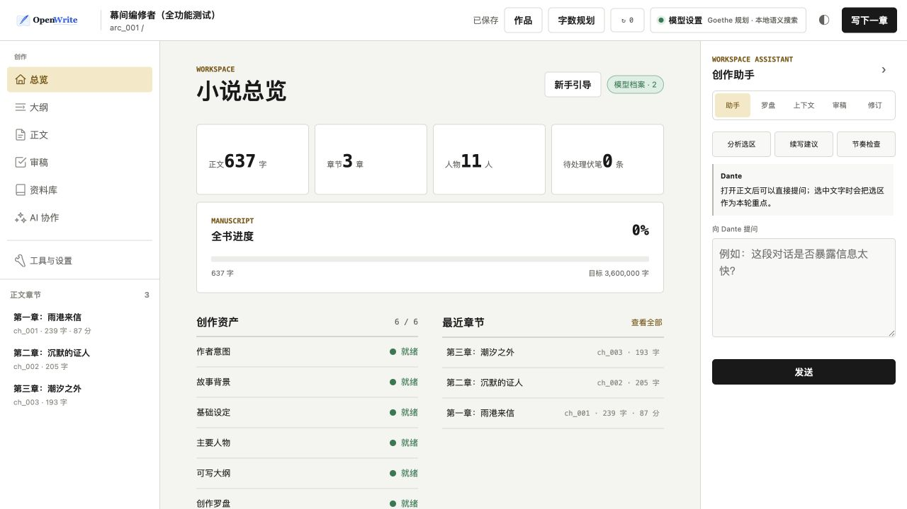
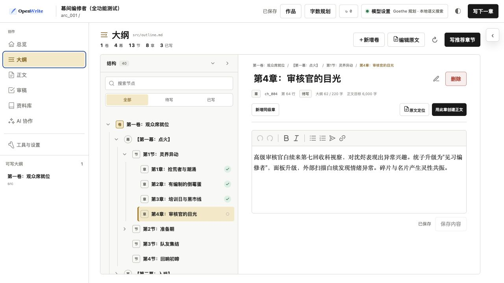
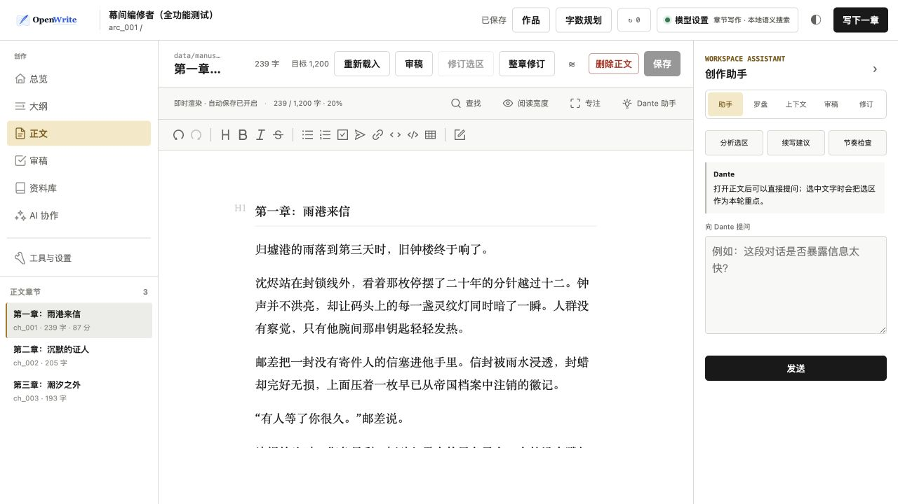
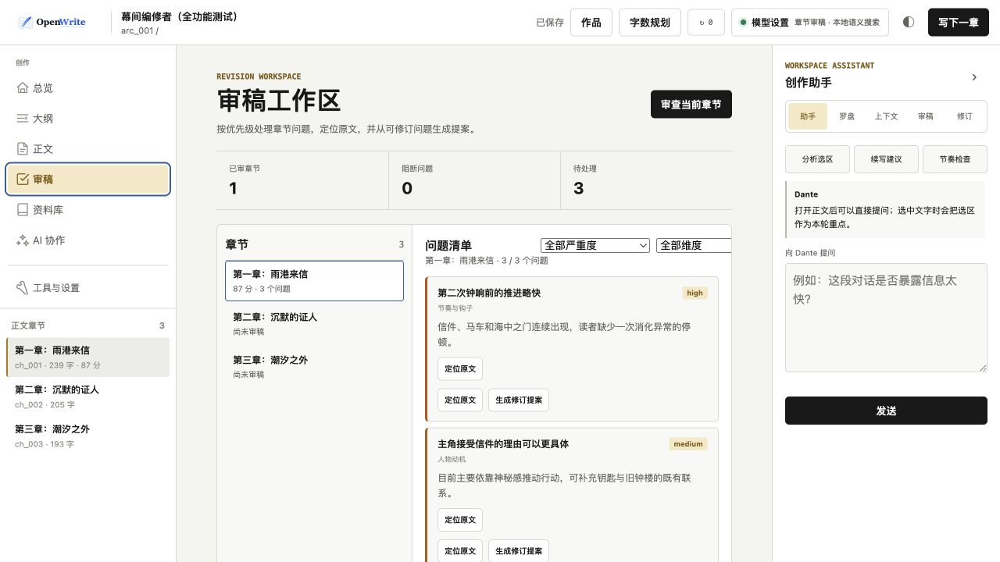

<p align="center">
  <picture>
    <source media="(prefers-color-scheme: dark)" srcset="assets/logo-dark.svg">
    <source media="(prefers-color-scheme: light)" srcset="assets/logo-light.svg">
    
  </picture>
</p>

<h1 align="center">面向长篇小说的 AI Agent 创作工作台<br><sub>从灵感、设定和大纲，一直写到审稿与成书</sub></h1>

<p align="center">
  <a href="pyproject.toml"></a>
  <a href="pyproject.toml">= 3.10"></a>
  <a href="LICENSE"></a>
  <a href="https://github.com/LiPu-jpg/Openwrite/stargazers"></a>
  <a href="https://github.com/LiPu-jpg/Openwrite/issues"></a>
</p>

<p align="center">
  <strong>长篇小说不是一次性 Prompt。</strong><br>
  OpenWrite 把作者意图、人物与世界状态、滚动大纲、章节记忆、写作、审稿和修订放进同一条可持续的创作流程。
</p>

<p align="center">
  <a href="#studio-工作台">Studio</a> ·
  <a href="#快速开始">快速开始</a> ·
  <a href="#工作原理">工作原理</a> ·
  <a href="#许可证">许可证</a> ·
  <a href="#致谢">致谢</a>
</p>

<p align="center">
  <a href="assets/screenshots/studio-overview.jpg">
    
  </a>
  <br>
  <sub><b>一本书，一个工作台</b> · 进度、创作资产、近期章节与 Dante 助手保持在同一视野</sub>
</p>

## OpenWrite 是什么

OpenWrite 专注于一件事：**让一本长篇小说在几十章、几百章之后仍然写得下去，而且不轻易丢失作者意图和故事事实。**

它不是只负责生成下一段文字的聊天壳，而是一套本地优先的小说创作系统：Goethe 负责把想法整理成可写资产，Dante 负责持续写作与审查；Studio 和两个 Agent 共用同一个小说内核，可选 CLI 也复用相同能力。最终状态以真实工具结果和落盘文件为准。

```text
灵感与素材
    ↓
Goethe：规划、人物、设定、大纲
    ↓  确认可写资产
Dante：组装上下文 → 写章 → 审稿 → 修订 → 状态结算
    ↓
Markdown / TXT / EPUB
```

| 适合这样的创作 | 它不承诺什么 |
|---|---|
| 正在写中长篇，需要长期维护人物、设定、伏笔和章节状态 | 输入一句话后，无需作者参与就自动生成一整本小说 |
| 已有旧稿或复杂设定，希望平稳接入 AI 协作流程 | 用聊天记录代替可检查、可版本化的作品资产 |
| 希望自己掌握方向，让 Agent 承担规划、检索、初稿、审稿和修订执行 | 让参考作品、模型判断或自动修订绕过作者确认 |
| 看重本地文件、明确写入边界和失败恢复 | 把所有正文与正典长期锁在某个云端平台中 |

## 核心能力

| 能力 | OpenWrite 如何处理 |
|---|---|
| **完整 Studio 工作台** | 从建书、模型配置、规划和资料编辑，到正文、审稿、检索、参考库、导入导出与诊断，都可以在一个本地 Web 界面中完成。 |
| **Goethe / Dante 双 Agent** | Goethe 长期整理创意与正典资产，Dante 持续推进正文、审稿和运行态；两者通过明确 handoff 衔接。 |
| **创作罗盘与单一真源** | `author_intent.md` 保存全书承诺，`current_focus.md` 保存近期目标；人物、世界和大纲以 `src/` 为确认版真源。 |
| **面向长篇的上下文** | 最近正文、滚动大纲、相关人物、世界规则、伏笔、真相文件、精确人物时态和语义召回共同组成 canonical packet。 |
| **可追踪的人物与世界状态** | 章节结算会更新客观事实；轻量内联批注可记录人物位置、伤势、认知等时态变化，并检查连续性冲突。 |
| **可靠写章与版本保护** | 作品级锁覆盖写章过程；正文、真相文件和章节记忆作为一个提交单元，失败时恢复写前快照。正文支持 checkpoint、批注和 AI 修订 diff。 |
| **37 维审稿闭环** | 审稿读取作者意图、正典、关系、风格和章节目标；问题可在 Studio 中定位、筛选并生成可审阅的修订提案。 |
| **私有参考库与风格采纳** | 对小说、旧稿和 Canon 做证据化拆解；只有人工明确选中的风格、规则或设定候选才会进入当前项目。 |
| **本地与云端检索** | 默认可使用本机 FastEmbed 完成向量检索，也支持 OpenAI-compatible embedding；需要关系遍历时再启用 LightRAG 图谱模式。 |
| **标准 SKILL.md 扩展** | Goethe / Dante 可按轮次启用标准 Skill；Skill 只提供有界指令和静态参考资料，不能绕过原有权限与写入确认。 |

## 快速开始

### 推荐：双击打开 Studio

下载或克隆完整仓库后，直接双击根目录中的启动文件：

- macOS：`启动 OpenWrite.command`
- Windows：`启动 OpenWrite.bat`

启动器会检查 Python 3.10+，在 `.openwrite-runtime/` 中创建隔离环境，安装或更新依赖并打开 Studio。通过 Git 克隆运行时，它每天最多检查一次源码更新，并且只会在工作区干净、当前分支可安全快进时自动更新；本地修改、领先提交、分支分叉或网络故障都不会阻断启动。可传入 `--update` 立即检查，或用 `--no-update` 跳过本次检查。从 ZIP 或已安装包运行时不会自动覆盖源码。它不会静默安装 Python；首次安装依赖需要联网。

### 从源码打开 Studio

```bash
git clone https://github.com/LiPu-jpg/Openwrite.git
cd Openwrite
python3.10 -m venv .venv
source .venv/bin/activate       # Windows: .venv\Scripts\activate
python -m pip install -e .
openwrite studio
```

Studio 默认只绑定 `127.0.0.1`。首次打开会通过界面引导你配置模型、创建作品、完善故事资产并开始写作。从框架仓库创建作品时，默认目录为仓库同级的 `OpenWriteNovels/<书名>`（仓库位于用户目录时即 `~/OpenWriteNovels/<书名>`），也可以在创建对话框中指定其他位置。

### 配置模型

推荐在 Studio 顶栏打开 **模型设置**。当前支持 OpenAI、Anthropic 和自定义 OpenAI-compatible 连接，可配置模型、Base URL、API Key、上下文窗口和最大输出，并在保存前测试连接。

API Key 默认只保存在当前 Studio 进程。选择“重启后自动恢复”后，密钥会写入本机用户私有目录的 `0600` 凭据文件，不会进入小说项目、Git 或浏览器存储。

## Studio 工作台

```bash
openwrite studio
```

**Studio 是 OpenWrite 首推的日常入口。** 建书、规划、资料维护、正文写作、审稿修订和成书导出都可以在这里完成；CLI 只是同一套能力面向脚本化与调试场景的补充。

<table>
  <tr>
    <td width="50%" align="center" valign="top">
      <a href="assets/screenshots/studio-outline.jpg"></a>
      <br><sub><b>滚动大纲</b> · 卷、幕、节、章分层管理，已写状态与正文目标直接可见</sub>
    </td>
    <td width="50%" align="center" valign="top">
      <a href="assets/screenshots/studio-editor.jpg"></a>
      <br><sub><b>正文编辑</b> · Markdown 即时渲染、自动保存、版本保护与 Dante 侧栏协作</sub>
    </td>
  </tr>
  <tr>
    <td colspan="2" align="center" valign="top">
      <a href="assets/screenshots/studio-review.jpg"></a>
      <br><sub><b>审稿闭环</b> · 按严重度与维度筛选问题，定位原文并生成可审阅的修订提案</sub>
    </td>
  </tr>
</table>

<p align="center"><sub>所有截图均来自本地 Studio 实测；截图中的短篇正文为演示内容。</sub></p>

### 从灵感到成书，都在 Studio 里完成

1. **创建或打开作品**：首次引导会检查模型配置和创作资产；顶栏可以随时切换作品、设置全书与分卷字数目标、查看后台任务，并为不同环节选择模型档案。
2. **和 Goethe 规划**：在 **AI 协作** 中持续讨论题材、卖点、人物关系、世界规则和想避免的套路。Goethe 会先汇总与提出候选，再展示 diff；只有本轮明确确认后才写入正式资产。
3. **整理可写资产**：在 **大纲** 中按卷、幕、节、章管理结构，筛选待写或已写节点，设置章节目标并从章纲创建正文；在 **资料库** 中维护作者意图、故事基础、人物档案和世界设定。
4. **用罗盘锁定近期方向**：右侧创作助手可随时查看创作罗盘和本章上下文，把阶段目标、必须保留与必须避免的内容固定进后续写作 packet。
5. **交给 Dante 推进正文**：从顶栏或大纲节点开始写下一章，填写本章指导和字数目标。Dante 会完成写前检查、上下文组装、初稿、事实提取与状态结算；正文落盘后仍可在 Markdown 编辑器中手改、批注或创建 checkpoint。
6. **审稿、修订并导出**：审稿工作区汇总 37 个维度的问题，支持按严重度和维度筛选、定位原文、生成修订提案并审阅 diff。完成后在 **项目迁移** 中导出 Markdown、TXT 或 EPUB。

已有 TXT 或 Markdown 正文也不需要重来：在 **工具与设置 → 项目迁移** 中先解析卷章预览，确认无冲突后导入，再让 Dante 从现有进度继续。

### Studio 工作区一览

| 工作区 | 主要功能 |
|---|---|
| **总览** | 集中查看正文与章节进度、人物数量、待处理伏笔、资产就绪度、审稿均分、token 使用、最近章节和系统建议的下一步。 |
| **大纲** | 卷、幕、节、章树形编辑；搜索节点；筛选待写/已写；设置章纲与字数目标；从大纲直接创建正文。 |
| **资料库** | 分类编辑作者意图、创作重点、故事基础、人物和世界设定；支持 Markdown 即时渲染、自动保存、导入导出与 revision 冲突检查。 |
| **正文** | 章节目录、字数目标、即时渲染编辑器、阅读宽度、专注模式、选区操作、批注、checkpoint、历史版本和修订记录。 |
| **创作助手** | 在当前页面直接与 Dante 对话，携带选区或正文上下文；快速执行选区分析、续写建议与节奏检查，并查看罗盘、上下文、审稿和修订状态。 |
| **审稿** | 汇总已审章节、阻断问题和待处理项；按严重度/维度筛选；定位证据；比较复审变化；为可修订问题生成提案。 |
| **AI 协作** | 保存 Goethe / Dante 长期会话，展示真实模型调用、工具执行、确认请求、校验、失败原因和落盘阶段，而不是只显示一段聊天结果。 |
| **项目搜索与连续性** | 跨正典、正文和参考资料进行精确与语义检索；检查人物位置、伤势、认知、时间线和伏笔，浏览可搜索、筛选、缩放与拖拽的实体关系拓扑。 |
| **深度研究** | 围绕创作问题启动有证据约束的多轮研究，可选择搜索提供方、证据策略和研究轮次，并在 Studio 中浏览归档报告。 |
| **参考库** | 导入参考作品、旧稿或同人 Canon，确认卷章覆盖，生成证据报告与多作品对照画像，再由用户逐条决定是否采纳。 |
| **Skills** | 查看标准 `SKILL.md` 与 Runtime Skill 的来源、适用 Agent、任务范围和权限，并在本轮 Goethe / Dante 对话中按需启用。 |
| **工具与设置** | 管理模型与作品、字数规划和任务中心；在高级工具中检查 canonical packet、同步诊断与章节运行；在项目迁移中完成正文导入和整书导出。 |

### 看得见的安全边界

- 正典、关系、世界和参考采纳等重要写入会先展示差异，并等待本轮确认。
- 浏览器保存带有 revision 冲突检查，避免覆盖外部编辑器刚写入的内容；正文自动保存同时保留 checkpoint、版本和修订记录。
- 作品级锁与事务回滚覆盖写章流程，任务中心会展示运行阶段和失败原因，不会把模型口头宣称当作完成状态。
- API Key 默认只存在于当前 Studio 进程；选择自动恢复后也只写入本机用户私有凭据文件。

需要排查问题时，可用 `openwrite studio --debug` 启动 Studio；脱敏日志会写入当前作品的 `data/logs/studio-debug.log`。

## 工作原理

### 一个小说内核，Studio 统一呈现

Studio、Goethe、Dante 和可选 CLI 不各自维护一套写章逻辑。Studio 把完整能力组织成可操作界面，底层入口共用同一个 action surface 和小说应用服务：

```text
Studio ──┐
Goethe ──┤
Dante ───┼─> Novel action surface ─> NovelApplicationService
CLI ─────┘                              ├─ canonical packet
                                        ├─ write / review / revision
                                        ├─ source and reference lifecycle
                                        └─ workflow / truth / memory / BookState
```

章节 ID、项目锁、事务回滚、错误码、workflow 推进、审稿存储和 BookState 结算因此只有一份契约。完成态来自工具结果与文件状态，不依赖模型口头宣称“已经完成”。

### 单一真源与运行态分离

```text
data/novels/{novel_id}/
├── src/                         # 人和 AI 共读的确认版真源
│   ├── outline.md
│   ├── story/
│   │   ├── author_intent.md
│   │   ├── current_focus.md
│   │   ├── background.md
│   │   └── foundation.md
│   ├── characters/*.md
│   └── world/*.md
└── data/                        # 运行态、正文、缓存与快照
    ├── manuscript/arc_*/ch_*.md
    ├── memory/chapters/
    ├── reviews/
    ├── style/
    ├── world/
    ├── workflows/
    └── planning/
```

- `src/outline.md` 是唯一大纲真源。
- `src/story/author_intent.md` 保存全书长期承诺。
- `src/story/current_focus.md` 保存当前阶段最高优先级目标。
- `data/` 保存正文、会话、章节记忆、审稿、状态、缓存和 workflow；通常不需要手工维护。
- 手改 `src/` 后，在 Studio 的 **工具与设置 → 高级工具** 中检查并同步，让派生数据与真源重新对齐。

### 从 OpenWrite 5.4 迁移已有作品

旧版项目只作为只读源，5.8 只迁移指定小说的正典资产，不复制旧版 server、前端或写作运行时。迁移工具会保留 src/、120 个真实章节、.md.bak 备份、history、snapshots、world、hierarchy 和 foreshadowing DAG，并在目标中生成 SHA-256 manifest。

先执行 dry-run 查看路径和数量：

    python -m tools.migrate_legacy_project --source "E:\AI\gp\Openwrite-main" --target "E:\AI\gp\Openwrite-mainV2" --novel-id system_urban --dry-run

确认 manifest 后执行迁移，再校验目标：

    python -m tools.migrate_legacy_project --source "E:\AI\gp\Openwrite-main" --target "E:\AI\gp\Openwrite-mainV2" --novel-id system_urban
    python -m tools.migrate_legacy_project --source "E:\AI\gp\Openwrite-main" --target "E:\AI\gp\Openwrite-mainV2" --novel-id system_urban --validate-only

工具不会覆盖已经存在的目标小说目录；失败时会清理本次 staging。迁移完成后，根部 novel_config.yaml 指向 system_urban，后续从 Openwrite-mainV2 使用 Studio、CLI 和统一的写作审查链。

### 长篇上下文与人物时态

写章时，最近两章正文固定进入上下文。系统再按本章大纲和出场人物召回最多 4 段更早正文，以及 2 段拆书或参考资料。语义召回只补充远距离记忆，不会覆盖正典或精确人物状态。

人物状态与有向关系可以用轻量批注记录：

```text
//**沈烬：仍在试探 -> 确认白续是敌人**
//**沈烬[位置]：贫民区工坊 -> 归墟港**
//**沈烬[伤势]：左臂轻伤 -> 已恢复**
//**沈烬~>白续:互相试探的敌对关系**
//**沈烬[与白续关系]：互相试探 -> 暂时结盟**
```

批注必须独占一行并位于代码围栏之外。大纲批注应放在对应章节标题下，或用 `@ch_070` 显式指定章节；正文批注会自动归入当前章节。系统会从大纲与正文重建索引，区分计划状态和实际状态。同章同人物同维度发生冲突时，正文事实优先用于当前状态与连续性判断，大纲计划仍保留在历史中。

`A~>B:具体关系` 用于注册从 A 指向 B 的当前有向关系，不会自动创建 `B~>A`；关系随剧情演变时应使用 `A[与B关系]：旧关系 -> 新关系` 状态批注。普通正文提及和“关系网络”段落不会自动生成连线。旧式 `A~B` 仍可读取以兼容已有项目，但 Agent 只会生成 `~>`。有效批注不会计入正文字数，也不会进入 Markdown、TXT 或 EPUB 成书；格式无效的批注会保留在原文中并报告错误。

### 有界记忆与可靠提交

每章完成后，OpenWrite 会保存摘要、客观观察、状态变化和各阶段 token 用量。下一章只注入与当前任务相关的有界信息，而不是把整本正文重新塞给模型。

作品级写锁覆盖上下文读取、模型调用和最终提交。正文、真相文件与章节记忆是同一个提交单元；其中任一步失败，系统会恢复写前快照，避免只写入半章或半份状态。

<details>
<summary><strong>上下文预算如何工作</strong></summary>

`OPENWRITE_CONTEXT_TOKENS` 表示模型的完整上下文窗口。系统会先扣除 `LLM_MAX_TOKENS` 输出预留和安全余量，再为章节 packet、Agent 会话、工具结果和最近消息分配输入预算。

当输入压力升高时，系统按稳定优先级渐进压缩：先处理可从正文重建的旧章节记忆，再处理大纲摘要，然后收缩真相状态、人物数量和精确上文，最后才启用提供商级硬适配。作者意图、创作罗盘和当前章在前几级不会被删除；原文、JSONL 会话历史和 `src/` 真源也不会因发送前压缩而被改写。

在 Studio 的 **工具与设置 → 高级工具** 中，可以检查某章的 canonical packet；正文右侧的 **上下文** 面板则用于查看当前章节信息。

</details>

## 项目搜索与参考库

### 本地向量或云端 embedding

默认的“向量 + 精确”策略只生成向量，不调用聊天模型；使用本机 FastEmbed 时，即使没有聊天 API Key 也可以搜索。需要实体关系遍历时，可切换为“图谱 + 向量”，由 LightRAG 额外调用 Chat Completions-compatible 模型提取实体与关系。

索引保存在作品私有目录 `.openwrite/lightrag/`，不会进入 Git。正典、人物、世界设定、正文、风格资料和已采用的参考资料会增量入库，未变化的文档不会重复生成向量。

日常使用直接在 Studio 的 **模型设置** 中选择本地 FastEmbed 或 OpenAI-compatible embedding，并在 **搜索** 工作区更新索引即可。以下环境变量只用于无界面服务器或自动化环境：

<details>
<summary><strong>服务器环境的检索配置</strong></summary>

```bash
# 本地 embedding
export OPENWRITE_LIGHTRAG_EMBEDDING_PROVIDER=local
export OPENWRITE_LIGHTRAG_MODE=naive
export OPENWRITE_FASTEMBED_CACHE_DIR=~/.cache/openwrite/fastembed

# OpenAI-compatible 云端 embedding
export OPENWRITE_LIGHTRAG_EMBEDDING_PROVIDER=openai
export OPENWRITE_LIGHTRAG_EMBEDDING_BASE_URL=https://api.openai.com/v1
export OPENWRITE_LIGHTRAG_EMBEDDING_API_KEY=your-embedding-key
export OPENWRITE_LIGHTRAG_EMBEDDING_MODEL=text-embedding-3-small
export OPENWRITE_LIGHTRAG_EMBEDDING_DIM=1536
```

</details>

### 参考作品不会自动污染项目

Studio 的 **项目迁移** 用于导入或导出完整 OpenWrite 项目；**参考库** 用于导入参考小说、自己的旧稿或同人 Canon，并进行证据化拆解。两者互不替代。

参考库默认位于 `~/.local/share/openwrite/reference-library/`，不直接进入小说工作区。导入意图决定哪些内容有资格成为候选：普通参考作品的专名、人物和具体情节不能晋升；自己的旧稿、同人 Canon 或反向重建项目可以提出设定候选，但不能把来源事实伪装成风格规则。

采用流程始终是：

```text
导入并确认范围 → 证据化拆解 → 单部报告 / 多作品对照
→ Goethe 讨论取舍 → 预览采纳 diff → 用户明确确认 → 编译进项目
```

每条候选都需要明确目标、主辅角色、适用范围和是否采用。Dante 只消费已经确认的项目资产，不替用户浏览私有参考库或暗中选择作品。

## 标准 Skills

OpenWrite 可以发现标准 `SKILL.md`，并继续兼容 `.openwrite/skills/*/manifest.yaml` Runtime Skill。标准 Skill 可以放在：

- 当前作品的 `.agents/skills/<skill-id>/SKILL.md` 或 `skills/<skill-id>/SKILL.md`
- 用户目录的 `~/.agents/skills/` 或 `~/.openclaw/skills/`
- `OPENWRITE_SKILL_DIRS` 指定的一个或多个目录

Skill 默认不会进入所有写作上下文。在 Goethe 或 Dante 的本轮消息中用 `@skill-id` 明确启用：

```text
@oh-story-review 检查 ch_007 的场景因果链，只给诊断和优先建议。
```

Studio 已内置一组 [oh-story-claudecode](https://github.com/worldwonderer/oh-story-claudecode) 的 OpenWrite 原生适配 Skill：`@oh-story-long-write`、`@oh-story-short-write`、`@oh-story-long-analyze`、`@oh-story-short-analyze`、`@oh-story-long-scan`、`@oh-story-short-scan`、`@oh-story-review` 和 `@oh-story-deslop`。它们按任务独立加载，不安装上游 hooks、不运行 CDP 抓榜脚本，也不改变 OpenWrite 的项目目录和写入确认协议。

下一轮未再次指定时会恢复默认上下文。Skill 中的脚本不会自动执行，工具权限只能被收窄，不能借 Skill 扩权或绕过写入确认。Studio 的 **Skills** 工作区可以查看发现结果、解析后的规则、适用 Agent 和诊断信息。

## CLI 与自动化（可选）

日常创作不需要记命令；Studio 已覆盖完整流程。CLI 保留给无界面服务器、脚本化批处理和精确调试，使用 `openwrite --help` 查看全部子命令。所有顶层命令都支持 `--project`，不需要先切换到作品目录：

```bash
openwrite studio --project ~/my_novel --debug
openwrite status --project ~/my_novel
```

## 高级配置（可选）

Studio 用户通常不需要设置环境变量；下表用于服务器部署、自动化和特殊模型路由。

| 变量 | 用途 | 默认值 |
|---|---|---|
| `LLM_API_KEY` | 模型 API Key | 未设置 |
| `LLM_MODEL` | 默认模型 | `gpt-4o-mini` |
| `LLM_BASE_URL` | 自定义 OpenAI-compatible 网关 | 服务商默认值 |
| `LLM_TEMPERATURE` | 默认温度 | `0.7` |
| `LLM_MAX_TOKENS` | 最大输出 token | `24000` |
| `OPENWRITE_CONTEXT_TOKENS` | 模型完整上下文窗口 | `64000` |
| `OPENWRITE_SKILL_DIRS` | 额外标准 Skill 目录 | 未设置 |
| `OPENWRITE_REFERENCE_LIBRARY_ROOT` | 本机私有参考库目录 | `~/.local/share/openwrite/reference-library` |
| `OPENWRITE_DEBUG` | Studio 后台 debug 日志 | 未开启 |

## 常见问题

### 应该先用 Goethe 还是 Dante？

在 Studio 的 **AI 协作** 中选择即可：只有灵感、人物或设定还没有形成可写大纲时，先和 Goethe 规划；已有可写资产或正在连载时，直接交给 Dante。

### 修改 `src/` 后为什么没有立即生效？

`src/` 是确认版真源，`data/` 中存在为运行效率生成的派生数据。手工修改后，在 Studio 的 **工具与设置** 中检查并执行同步，让派生数据重新对齐。

### `outline_draft.md` 是另一份大纲吗？

不是。它只是规划过程中的草稿或候选，`src/outline.md` 才是唯一确认版大纲。

### 为什么 Agent 有时先要求确认？

因为对大纲、人物、世界、关系、参考采纳等正式资产的写入必须先展示 diff，并且只接受本轮明确确认。这个确认不能由旧消息、模型猜测或口头完成声明替代。

### 小说数据会上传到哪里？

项目文件、会话和索引默认保存在本机。只有真正发送给所选模型或 embedding 服务的请求内容会离开本机；选择本地 FastEmbed 可以让向量生成也留在本机。

## 开发与测试

```bash
python -m pip install -e ".[dev]"
pytest
```

提交问题或功能建议请前往 [GitHub Issues](https://github.com/LiPu-jpg/Openwrite/issues)。项目仍在持续迭代，涉及作品数据的改动建议先在自己的项目仓库中保留版本记录。

## Star History

<a href="https://www.star-history.com/?repos=LiPu-jpg%2FOpenwrite&type=date&legend=top-left">
 <picture>
   <source media="(prefers-color-scheme: dark)" srcset="https://api.star-history.com/chart?repos=LiPu-jpg/Openwrite&type=date&theme=dark&legend=top-left&sealed_token=vZdhG7v61Eao3XAEYJgdiUHyXI-8yBimzmBl9bOkwlmrysCbV6EMlTGd1O4cGzDfONuyymBDIZ7l2-GcyoSY60O55NDQmiQf_23sZPTRgBfPLHzmu8JWSg" />
   <source media="(prefers-color-scheme: light)" srcset="https://api.star-history.com/chart?repos=LiPu-jpg/Openwrite&type=date&legend=top-left&sealed_token=vZdhG7v61Eao3XAEYJgdiUHyXI-8yBimzmBl9bOkwlmrysCbV6EMlTGd1O4cGzDfONuyymBDIZ7l2-GcyoSY60O55NDQmiQf_23sZPTRgBfPLHzmu8JWSg" />
   
 </picture>
</a>

## 许可证

OpenWrite 自有代码采用 [Apache License 2.0](LICENSE)。仓库中明确标注为第三方来源的代码、内置 Skill 与 vendored 资源继续遵循各自目录中的许可证和署名声明。

## 致谢

OpenWrite 建立在许多可靠的开源项目之上，特别感谢：

- **检索与长期记忆**：[LightRAG](https://github.com/HKUDS/LightRAG) 提供图谱与向量检索能力，[FastEmbed](https://github.com/qdrant/fastembed) 提供本地 embedding 推理。
- **LLM 接入**：[LiteLLM](https://github.com/BerriAI/litellm) 提供统一模型网关与模型元数据；[OpenAI Python SDK](https://github.com/openai/openai-python) 和 [Anthropic Python SDK](https://github.com/anthropics/anthropic-sdk-python) 支撑官方协议接入。
- **编辑与渲染**：[Vditor](https://github.com/Vanessa219/vditor) 提供 Studio 的 Markdown 编辑与即时渲染，[markdown-it-py](https://github.com/executablebooks/markdown-it-py) 用于安全渲染对话和 EPUB 内容。
- **Python 基础设施**：[Pydantic](https://github.com/pydantic/pydantic) 负责结构化数据校验，[PyYAML](https://github.com/yaml/pyyaml) 承载项目配置与运行态，[prompt_toolkit](https://github.com/prompt-toolkit/python-prompt-toolkit) 提供 Goethe / Dante 的交互式终端体验。
- **创作方法论**：[oh-story-claudecode](https://github.com/worldwonderer/oh-story-claudecode) 为内置 Oh Story Skill 套件提供了长短篇写作、拆文、审稿与市场研究方法；OpenWrite 在 MIT 许可下完成了项目协议与权限边界适配。

也感谢所有推动 AI 写作、长上下文、知识检索和创作工作流发展的开源项目与贡献者。

特别感谢真诚、友善、团结、专业的 [Linux DO 社区（L 站）](https://linux.do/)，这里汇集了大量关于 AI、开发与开源实践的高质量讨论。

<p align="center">
  <strong>Linux DO · 新的理想型社区</strong><br>
  <a href="https://linux.do/">https://linux.do/</a>
</p>
