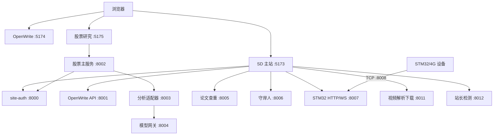

# Star Dominion · 逐梦工具箱

Star Dominion 是一个模块化 Web 单仓库：以在线工具箱为主入口，组合全站认证、A 股研究、AI 长篇写作、AI 角色陪伴、论文查重和 STM32/4G 设备监测。

仓库中的业务模块保持独立进程与数据边界，通过统一登录、固定端口和 Nginx 路由组成完整网站。开发环境可使用一组 PowerShell 脚本启动、检查和停止全部服务。

## 核心模块

| 模块 | 主要能力 | 技术栈 | 本地入口 |
| --- | --- | --- | --- |
| SD 主站 | 在线工具目录、统一导航、认证入口、STM32 页面 | React、TypeScript、Vite | `http://127.0.0.1:5173/` |
| site-auth | 登录、会话、CSRF、管理员和用户管理 | FastAPI、SQLAlchemy、SQLite | `http://127.0.0.1:5173/auth/login` |
| 研报中心 | GitHub 每周热门项目扫榜、综合榜及语言分榜 | React、FastAPI、SQLite | `http://127.0.0.1:5173/reports` |
| 股票研究 | 九点猫研、个人策略、真实行情、K 线、AI 分析、宝妈指数 | React、FastAPI、AKShare | `http://127.0.0.1:5175/stock/` |
| OpenWrite | 长篇小说写作、审稿、角色、世界观和导出 | React、FastAPI、Python CLI | `http://127.0.0.1:5174/openwrite/` |
| 守岸人 3.0 | AI 角色对话、互动剧情、语音、记忆和世界书 | FastAPI、原生 Web 前端 | `http://127.0.0.1:8006/` |
| 论文查重 | TXT、DOCX、PDF 双文档相似度分析 | FastAPI、Python | 由 SD 主站调用 |
| STM32/4G | 北斗、IMU、轨迹、告警、命令和设备 TCP 通信 | Python、WebSocket | `http://127.0.0.1:5173/stm32/` |
| 视频解析下载 | 抖音/B站单个公开视频解析、清晰度选择和临时下载 | FastAPI、yt-dlp、FFmpeg | `http://127.0.0.1:5173/tool/video-parser-downloader` |
| 站长工具服务 | 受控 HTTP、DNS、SSL、WebSocket 公网状态检查 | FastAPI、标准库网络栈 | 由 SD 主站调用 |

## 五分钟快速启动

### 1. 环境要求

- Windows 10/11 与 PowerShell 5.1 或更高版本。
- Python 3.11 或更高版本。
- Node.js 20 或更高版本，并确保 `node`、`npm`、`npx.cmd` 可用。
- Git。

小红书登录态采集由 Node.js 启动固定版本的 Playwright MCP，因此运行股票模块时也需要 npm。

### 2. 克隆并安装依赖

```powershell
git clone https://github.com/yunxigy/Star-Dominion.git
cd Star-Dominion

python -m venv .venv
Set-ExecutionPolicy -Scope Process Bypass
.\.venv\Scripts\Activate.ps1
python -m pip install --upgrade pip

python -m pip install -e .\site-auth
python -m pip install -r .\Openwrite-main\requirements.txt
python -m pip install -r .\plagiarism\requirements.txt
python -m pip install -r .\4G\requirements.txt
python -m pip install -r ".\守岸人3.0\server\requirements.txt"
python -m pip install -e ".\video-downloader[dev]"

Push-Location .\stock-research-package\stock-module\backend
python -m pip install -e ".[dev,workers]"
Pop-Location

Push-Location .\stock-research-package\stock-module\analysis-service
python -m pip install -e .
Pop-Location

npm ci --prefix .\SD
npm ci --prefix .\Openwrite-main\frontend
npm ci --prefix .\stock-research-package\stock-module\frontend
```

后续启动前先激活同一个虚拟环境，确保启动脚本找到已安装依赖的 `python`。

### 3. 准备本地配置

```powershell
Copy-Item .env.local.example .env.local
python -c "import secrets; print(secrets.token_urlsafe(48))"
```

把命令输出填入 `.env.local` 的 `SITE_AUTH_INTERNAL_KEY`。该值至少需要 32 个字符，并且只用于服务间认证。

开发环境中的股票模型主密钥、网关令牌和签名密钥留空时，会在被 Git 忽略的数据目录中自动生成。生产环境必须显式配置所有密钥。

### 4. 启动并检查完整系统

```powershell
Set-ExecutionPolicy -Scope Process Bypass
.\.venv\Scripts\Activate.ps1
.\scripts\start-local.ps1
.\scripts\check-local.ps1
```

`Set-ExecutionPolicy -Scope Process Bypass` 只影响当前 PowerShell 进程，关闭窗口后自动失效，不会更改系统级执行策略。

`start-local.ps1` 默认启动 12 个后端/设备进程和 3 个前端，共监听 16 个端口（其中 STM32 同时占用 8007、8008）。只需要后端时使用：

```powershell
.\scripts\start-local.ps1 -WithoutFrontends
```

运行日志与进程元数据保存在 `.runtime/`，该目录不会提交到 Git。启动失败时优先查看 `.runtime/logs/*.err.log`。

停止脚本只会终止由本仓库启动并记录的进程：

```powershell
.\scripts\stop-local.ps1
```

## 本地服务与访问地址

### 开发前端

| 端口 | 服务 | 地址 |
| ---: | --- | --- |
| 5173 | SD 主站与统一登录 | `http://127.0.0.1:5173/` |
| 5174 | OpenWrite 前端 | `http://127.0.0.1:5174/openwrite/` |
| 5175 | 股票研究前端 | `http://127.0.0.1:5175/stock/` |

股票前端的 Vite `base` 是 `/stock/`。直接访问 `http://127.0.0.1:5175/` 时出现路径提示属于正常行为，应打开 `/stock/`。

### 后端与设备服务

| 端口 | 服务 | 用途 | 公网策略 |
| ---: | --- | --- | --- |
| 8000 | site-auth | 全站认证 | 仅经 `/auth-api/` |
| 8009 | 研报服务 | GitHub 周榜、采集状态和管理员刷新 | 仅经 `/reports-api/` |
| 8001 | OpenWrite | 写作 API 与 WebSocket | 仅经 `/ow-api/`、`/ws/` |
| 8002 | 股票主服务 | 晨报、目录、候选、宝妈指数和任务 | 仅经 `/stock-api/` |
| 8003 | 个股分析适配器 | 调用详细分析流水线 | 内部服务，不公开 |
| 8004 | 股票模型网关 | 校验签名并注入服务端模型密钥 | 内部服务，不公开 |
| 8005 | 论文查重 | 文档上传与相似度分析 | 仅经 `/plagiarism-api/` |
| 8006 | 守岸人 | 角色聊天 API 与页面 | 仅经 `/api/`、`/wuwa/` |
| 8007 | STM32 HTTP/WebSocket | 网页数据和设备命令 | 仅经 `/stm32/api/` |
| 8008 | STM32 原始 TCP | 4G 设备长连接 | 只允许设备来源白名单 |
| 8010 | 文档转换中心 | Office/PDF/Markdown/HTML/OCR 转换与批量打包 | 仅经 `/document-api/` |
| 8011 | 视频解析下载 | 抖音/B站单个公开视频解析与临时任务下载 | 仅经 `/video-api/` |
| 8012 | 站长检测服务 | 受控公开网站 HTTP、DNS、SSL、WebSocket 检查 | 仅经 `/webmaster-api/` |

本地脚本会让 HTTP 服务监听 `127.0.0.1`。生产环境由 Nginx 提供统一 HTTPS/WSS 入口，8003 和 8004 不应配置公网反向代理。

## 首次创建管理员

仓库不提供默认管理员账号或默认密码。先准备 `.env.local`，然后在仓库根目录执行：

```powershell
Get-Content .env.local |
  Where-Object { $_ -match '^\s*[^#][^=]*=' } |
  ForEach-Object {
    $name, $value = $_ -split '=', 2
    Set-Item -Path "Env:$($name.Trim())" -Value $value
  }

Push-Location site-auth
python -m site_auth.cli create-admin `
  --email <ADMIN_EMAIL> `
  --username <ADMIN_USERNAME>
Pop-Location
```

命令行随后会显示两次隐藏的密码输入提示。密码至少需要 12 个字符：

- 在提示后输入密码并按 Enter；终端不回显字符是正常的。
- 不要在普通的 `PS>` 提示符后直接输入密码，否则 PowerShell 会把它当成命令。
- 不要把真实密码写进 README、脚本、`.env.local.example` 或 Git。

管理员创建完成后，在 `http://127.0.0.1:5173/auth/login` 使用用户名或邮箱登录。

已有管理员需要修改密码时使用 `reset-admin`。只有明确要删除全部现有账号和会话时，才使用带 `--confirm-delete-all-users` 的 `recreate-admin`；操作前应备份 `site-auth` 数据库。

如需让完整冒烟检查验证登录态，可仅在本地 `.env.local` 中填写：

```dotenv
SITE_ADMIN_IDENTITY=
SITE_ADMIN_PASSWORD=
```

在等号后填写本地管理员用户名（或邮箱）和密码。这两个值只供 `scripts/check-local.ps1` 使用，`.env.local` 已被 Git 忽略。

## 股票研究与宝妈指数

股票模块当前面向沪深 A 股主板，排除科创板、创业板、北交所、ST 和退市股票。主要数据与页面能力包括：

- 股票目录：通过 AKShare 获取真实沪深主板名单，支持代码、中文名称和拼音首字母搜索；工作日 07:45 自动更新，管理员可手动刷新。
- 九点猫研：把隔夜市场主题映射到 A 股候选，展示完整晨报、候选依据与来源。
- 个人策略：结合热门题材、2B 法则、首板沿 5 日线和龙头识别生成独立候选池。
- 题材识别：优先使用同花顺热门概念和概念成分，故障时降级到其他真实行情源。
- 个股详情：以页面大框展示研究依据、风险、失效条件和东方财富前复权日 K 线，支持 20、60、120 个交易日。
- AI 分析：登录后选择个人或平台模型配置，对指定股票创建异步详细分析任务。

更完整的 Worker、API、模型网关和故障排查说明见[股票研究模块文档](stock-research-package/stock-module/README.md)。

### 宝妈指数

宝妈指数是独立的反向社区情绪温度计，不参与九点猫研或个人策略候选排序。

- 数据只来自东方财富真实公开帖子和小红书登录态真实搜索结果。
- 小红书通过 `rednote-mcp` 的只读 Playwright MCP 接入，后端继续提供稳定的 `xhs_*` 适配接口。
- 系统每天 `08:30` 按 `Asia/Shanghai` 时区自动采集。
- 管理员可以在股票页面手动刷新。
- 单个来源失败时保存另一来源的真实结果；两个来源都失败时保留最近真实快照，不用模拟数据覆盖。

首次使用小红书时：

```text
登录管理员 → 打开 http://127.0.0.1:5175/stock/
→ 找到“宝妈指数” → 点击“打开小红书登录窗口”
→ 在 Playwright 浏览器窗口完成登录 → 点击“立即刷新宝妈指数”
```

登录态仅保存在 `STOCK_XHS_DATA_DIR` 指向的本地数据目录。该目录已被 Git 忽略，不应放入静态目录、公开备份或提交到仓库。

## 项目架构



生产环境由 Nginx 将统一域名路径转发到这些服务。开发环境的三个 Vite 前端各自运行，以便单独调试。

## 仓库目录

```text
Star-Dominion/
├── SD/                              # 主站与在线工具
├── site-auth/                       # 全站认证服务
├── stock-research-package/
│   └── stock-module/
│       ├── backend/                 # 股票主服务、Worker、模型网关
│       ├── analysis-service/        # 个股分析适配器
│       └── frontend/                # 股票研究页面
├── Openwrite-main/                  # AI 长篇写作
├── 守岸人3.0/                        # AI 角色陪伴
├── plagiarism/                      # 论文查重
├── 4G/                              # STM32/4G 服务
├── video-downloader/                # 视频解析与临时下载服务
├── webmaster-inspector/             # 受控站长网络检测服务
├── scripts/                         # 本地启动、检查、停止脚本
├── deploy/                          # 当前生产部署示例
├── .env.local.example              # 本地环境变量模板
├── .env.production.example         # 生产环境变量模板
└── nginx.conf                      # Nginx 路由参考
```

`stock-research-package/upstreams/` 是本地上游检出目录，不属于主仓库提交内容。同花顺题材相关依赖与适配代码保留在股票模块中。

## 配置与敏感信息

- `.env.local`、`.env.production`、运行日志、缓存、SQLite 数据、构建产物和小红书登录态不得提交。
- `.env.local.example` 和 `.env.production.example` 只能包含变量名与非敏感示例。
- `SITE_AUTH_INTERNAL_KEY` 用于内部会话校验，不得复用管理员密码。
- 股票个人模型 API Key 使用 Fernet 加密保存；平台模型 Key 只存在于服务端环境变量。
- 浏览器端 `VITE_*` 变量会进入构建产物，只能放允许公开且已绑定域名的前端配置。
- 生产环境必须启用 HTTPS、Secure Cookie，并让除设备 TCP 端口 8008 外的 HTTP 服务只监听回环地址。

提交前至少检查：

```powershell
git status --short
git diff --check
git diff --cached
```

不要提交 `.runtime/`、`data/`、`dist/`、`node_modules/`、日志、真实环境文件或 API 密钥。

## 测试与检查

完整系统启动后：

```powershell
.\scripts\check-local.ps1
```

该脚本检查端口 `8000`–`8011`、主要健康接口、股票目录、宝妈指数、文档转换与视频解析能力和匿名权限边界；本地配置管理员凭据后，还会检查跨服务登录会话。

常用模块验证：

```powershell
# SD
npm --prefix .\SD test
npm --prefix .\SD run lint
npm --prefix .\SD run validate
npm --prefix .\SD run build

# site-auth
python -m pytest .\site-auth\tests

# 股票主服务与分析适配器
python -m pytest .\stock-research-package\stock-module\backend\tests
python -m pytest .\stock-research-package\stock-module\analysis-service\tests

# 股票前端
npm --prefix .\stock-research-package\stock-module\frontend test
npm --prefix .\stock-research-package\stock-module\frontend run build

# OpenWrite
python -m pytest .\Openwrite-main\tests
npm --prefix .\Openwrite-main\frontend run build

# Webmaster inspector
python -m pytest .\webmaster-inspector\tests
```

修改端口、认证 Cookie、Nginx 路由、股票内部签名或跨模块代理后，必须重新运行完整冒烟检查。

## 生产部署

当前整合架构的宝塔部署步骤见[宝塔上线操作手册](deploy/baota/README.md)。部署时：

1. 从 `.env.production.example` 创建服务器私有环境文件并生成互不相同的密钥。
2. 使用独立 Python 虚拟环境运行各后端进程。
3. 构建三个前端并由 Nginx 托管，不使用 Vite 开发服务器承载生产流量。
4. 保留既有 `/stock/`、`/stock-api/` 路由，合并配置前先执行 `nginx -t`。
5. 仅向设备白名单开放 8008，其他服务不直接暴露公网。
6. 上线前备份认证、股票、守岸人和 OpenWrite 数据目录。

根目录 `DEPLOY.md` 包含部分合并前的历史端口示例，只适合作为背景资料；当前端口与进程应以本 README、`deploy/baota/README.md`、`nginx.conf` 和实际启动脚本为准。

## 子项目文档

- [SD 主站](SD/README.md)
- [股票研究模块](stock-research-package/stock-module/README.md)
- [OpenWrite](Openwrite-main/README.md)
- [守岸人 3.0](守岸人3.0/README.md)
- [视频解析下载服务](video-downloader/README.md)
- [宝塔上线操作手册](deploy/baota/README.md)

## 许可证与第三方项目

本仓库当前没有统一的根许可证文件。股票模块整合了多个开源上游与数据适配器，各自的版权和许可状态可能不同。

对外分发、商业部署或二次授权前，请逐项核对所使用子项目、npm/Python 依赖、数据源以及上游仓库的最新许可证和服务条款。小红书和东方财富采集仅应在合法授权、合理频率和只读场景下使用。
