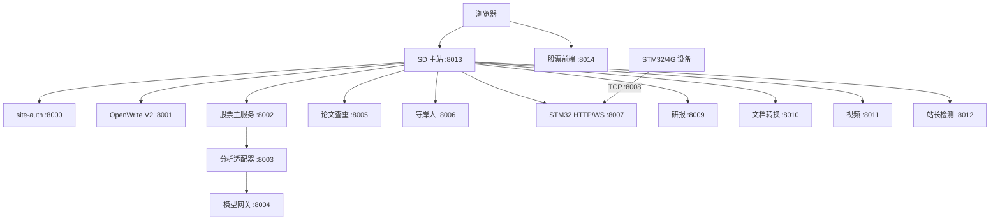

# Star Dominion · 逐梦工具箱

> 一个以在线工具箱为入口、把效率工具、股票研究、AI 写作、AI 角色陪伴和设备监测放在同一套本地优先架构里的 Web 单仓库。

Star Dominion 适合两类使用方式：普通用户从 SD 主站直接打开工具；开发者或部署者按模块启停服务、检查数据边界，并通过统一登录和 Nginx 路由组成完整站点。

本 README 是全仓库总览，重点说明“每个模块解决什么问题、如何互相协作、从哪里访问”。各模块的完整安装、环境变量、API、故障排查和生产部署，请以对应子项目 README 为准。

## 你可以用它做什么

- **快速处理文件**：PDF、图片、音频、视频、文档、表格、文本和代码工具大多直接在浏览器运行。
- **完成研究工作流**：从 GitHub 周榜、A 股晨报和候选筛选，到个股结构化依据与可选 AI 分析。
- **持续创作长篇内容**：OpenWrite V2 将规划、人物、世界观、写作、审稿、修订和导出放在同一工作台。
- **进行角色陪伴和互动剧情**：守岸人支持角色、记忆、世界书、Persona、分支对话、语音和备份。
- **连接真实设备**：STM32/4G 服务提供网页数据、设备命令、WebSocket 和受白名单保护的 TCP 长连接。

## 模块地图

| 模块 | 解决的问题 | 主要能力 | 用户入口 | 详细文档 |
| --- | --- | --- | --- | --- |
| **SD 逐梦工具箱** | 临时找工具、处理文件或完成小任务 | 212 个工具、19 个分类、统一搜索、收藏/最近使用、游戏和专业工具 | `http://127.0.0.1:8013/` | [SD/README.md](SD/README.md) |
| **site-auth** | 多模块共用一套账号与会话 | 登录、会话、CSRF、管理员、用户和服务间校验 | `http://127.0.0.1:8013/auth/login` | 认证约定见本 README 与各模块文档 |
| **股票研究** | 把市场信息整理成可解释的研究结果 | 九点猫研、个人策略、主板目录、个股详情、AI 分析、宝妈指数 | `http://127.0.0.1:8014/stock/` | [stock-module/README.md](stock-research-package/stock-module/README.md) |
| **OpenWrite V2** | 长篇小说容易失去设定、事实和写作节奏 | Goethe/Dante 双 Agent、正典资产、写作审稿闭环、版本和导出 | `http://127.0.0.1:8013/openwrite/` | [Openwrite-mainV2/README.md](Openwrite-mainV2/README.md) |
| **守岸人 3.0** | 让角色对话和互动剧情可以长期维护 | 角色、群聊、记忆、世界书、Persona、Prompt Manager、语音、分支和备份 | `http://127.0.0.1:8013/wuwa/` | [守岸人3.0/README.md](守岸人3.0/README.md) |
| **研报中心** | 追踪 GitHub 本周热门项目 | 综合榜、语言分榜、采集状态、管理员刷新和 AI 早报 | `http://127.0.0.1:8013/reports` | [research-reports/README.md](research-reports/README.md) |
| **文档转换中心** | 在不同办公格式之间可靠转换 | Office/PDF/Markdown/HTML/OCR、表格提取和批量 ZIP | 由 SD 工具调用 | [document-converter/README.md](document-converter/README.md) |
| **视频解析下载** | 处理单个公开短视频 | 抖音/B 站解析、清晰度选择、临时任务和安全下载令牌 | 由 SD 工具调用 | [video-downloader/README.md](video-downloader/README.md) |
| **论文查重** | 比较两份文档的文本相似度 | TXT、DOCX、PDF 双文档分析 | 由 SD 工具调用 | 代码与测试见 `plagiarism/` |
| **STM32/4G** | 查看设备数据并下发受控命令 | HTTP、WebSocket、北斗/IMU/轨迹/告警和设备 TCP | `http://127.0.0.1:8013/stm32/` | 代码与配置见 `4G/` |
| **站长检测** | 在受控范围内检查公开网站状态 | HTTP、DNS、SSL、WebSocket 和基础网络状态 | 由 SD 工具调用 | 代码与测试见 `webmaster-inspector/` |

## 服务、端口与代理（统一表）

所有本地服务按 `8000` 起连续分配。SD 的 `8013` 是统一前端入口，股票前端单独使用 `8014`；生产环境对外只暴露 Nginx 的 `80/443`，后端端口保持内网或回环访问。

| 端口 | 类型 | 服务 | 本地入口或用途 | SD/Nginx 代理路径 | 公网策略 |
| ---: | --- | --- | --- | --- | --- |
| **8000** | 后端 | site-auth | `/health`、统一登录与会话 | `/auth-api/` | 仅内部代理 |
| **8001** | 后端 + 页面 | OpenWrite V2 Studio | `http://127.0.0.1:8001/` | `/openwrite/`、`/ow-api/`、`/ws/` | 仅内部代理 |
| **8002** | 后端 | 股票主服务 | 晨报、目录、候选、宝妈指数、任务 | `/stock-api/` | 仅内部代理 |
| **8003** | 后端 | 个股分析适配器 | 调用详细分析流水线 | 无，内部调用 | 不公开 |
| **8004** | 后端 | 股票模型网关 | 验签并注入服务端模型密钥 | 无，内部调用 | 不公开 |
| **8005** | 后端 | 论文查重 | 文档上传与相似度分析 | `/plagiarism-api/` | 仅内部代理 |
| **8006** | 后端 + 页面 | 守岸人 3.0 | 角色聊天和互动剧情 | `/api/`、`/wuwa/` | 仅内部代理 |
| **8007** | 后端 | STM32 HTTP/WebSocket | 网页数据、设备命令和实时状态 | `/stm32/api/` | 仅内部代理 |
| **8008** | 设备 | STM32 原始 TCP | 4G 设备长连接 | 不经网页代理 | 只允许设备来源白名单 |
| **8009** | 后端 | 研报服务 | GitHub 周榜和采集状态 | `/reports-api/` | 仅内部代理 |
| **8010** | 后端 | 文档转换中心 | Office/PDF/Markdown/HTML/OCR | `/document-api/` | 仅内部代理 |
| **8011** | 后端 | 视频解析下载 | 公开视频解析和临时任务下载 | `/video-api/` | 仅内部代理 |
| **8012** | 后端 | 站长检测服务 | 受控 HTTP、DNS、SSL、WebSocket 检查 | `/webmaster-api/` | 仅内部代理 |
| **8013** | 前端 | SD 主站 | `http://127.0.0.1:8013/` | 根路径统一入口 | Vite 仅用于开发 |
| **8014** | 前端 | 股票研究前端 | `http://127.0.0.1:8014/stock/` | SD 的 `/stock/` 开发代理 | Vite 仅用于开发 |

股票前端的 Vite `base` 是 `/stock/`：直接访问 `8014` 时打开 `/stock/`，从 SD 主站访问也使用 `/stock/` 代理。OpenWrite V2 页面和 API 在同一个 `8001` Studio 服务中，不再启动旧的独立前端。

## 模块详解

### SD 逐梦工具箱

SD 是整个项目的主入口。当前注册表包含 **212 个工具、19 个分类**，工具名称、搜索标签、隐私级别和稳定状态都集中维护在 `SD/tools/registry.tsx`。

覆盖范围包括：

- **文件与媒体**：PDF 合并/拆分/压缩/加密、图片压缩/裁剪/格式转换、Base64、证件照、音频处理、字幕和公开视频解析。
- **开发与数据**：JSON/YAML/TOML/CSV、编码与哈希、API/OpenAPI、网络诊断、Cron、CIDR、日志、SQL、Excel/CSV 和文件校验。
- **办公与学术**：发票 OCR、表格清洗与对比、Word 检查、合同条款辅助、论文格式、参考文献、公式、文献笔记和术语一致性检查。
- **生活与趣味**：单位换算、密码、条码二维码、压缩包、颜色、文本、抽奖、测评、塔罗星座、鼠标测试和本地小游戏。
- **棋类游戏**：井字棋、四子棋、五子棋、黑白棋、国际象棋、中国象棋和跳棋，支持单机/双人及本地 AI，棋局不上传服务器。

工具注册信息用 `privacy` 和 `status` 描述边界：`local` 表示浏览器本地处理，`third-party-api` 表示会调用外部服务，`backend-upload` 表示文件会发往本站后端；`stable`、`beta` 和 `experimental` 用于提示成熟度。涉及 OCR、AI、网络目标或媒体平台的工具会在页面中显示额外限制。

页面路由：`/` 首页、`/gj` 完整目录、`/category/:categoryId` 分类、`/tool/:toolId` 工具详情、`/stm32/` 设备窗口、`/auth/login` 登录、`/ai` OpenWrite 入口、`/wuwa` 守岸人入口和 `/stock/` 股票入口。

### site-auth 统一认证

site-auth 是全站唯一的密码与会话来源，使用 FastAPI、SQLAlchemy 和 SQLite，负责：

- 用户登录、登出、会话 Cookie、CSRF 校验和跨模块登录状态；
- 管理员创建、密码重置、用户身份和权限；
- 供股票、守岸人、研报等服务使用的内部服务密钥校验。

其他模块不会复制统一账号密码。守岸人只维护一条按 `site_user_id` 绑定的本地影子资料，以兼容角色、聊天和记忆数据。仓库不提供默认管理员账号或密码，首次使用必须由管理员命令创建账号。

### 股票研究

股票模块面向沪深 A 股主板，排除科创板、创业板、北交所、ST 和退市股票。它由 `8002` 主服务、`8003` 分析适配器、`8004` 模型网关和 `8014` React 前端组成。

核心研究链路：

1. **九点猫研**读取隔夜主题、重要消息和上游晨报，形成可解释的候选依据。
2. **个人策略**独立计算热门题材、2B 法则、首板沿 5 日线、龙头识别和小市值倍量吸筹，不与九研分数混用。
3. **个股详情**先展示来源、维度分、历史统计、催化、风险和失效条件，再按用户明确选择的配置与模型创建 AI 分析任务。
4. **宝妈指数**单独采集东方财富公开帖子和小红书只读搜索结果，作为反向情绪温度计，不改变候选排序。

目录和行情优先使用真实数据源并写入 SQLite；上游失败时保留最近成功快照并明确标记状态，不用模拟数据覆盖真实结果。完整 Worker、模型网关、安全边界和故障排查见[股票研究模块 README](stock-research-package/stock-module/README.md)。

### OpenWrite V2

OpenWrite V2 是本地优先的长篇小说创作工作台。`8001` 同时提供 Studio 页面、REST API 和 WebSocket，SD 通过 `/openwrite/` 代理嵌入，不再依赖旧的独立前端。

- **Goethe**负责整理灵感、作者意图、人物、世界观和滚动大纲。
- **Dante**负责组装上下文、写章、审稿、生成修订建议并推进章节状态。
- **单一真源**把 `src/` 中的正典资产与运行态手稿、工作流、缓存分开保存。
- **可追踪创作**支持人物时态、关系、伏笔、章节记忆、版本、checkpoint、批注和 Diff。
- **参考库与 Skills**支持本地或 OpenAI-compatible embedding，只有人工确认的参考信息才进入项目。
- **导出与诊断**覆盖 Markdown、TXT、EPUB/PDF 等成书路径，并保留日志、版本和失败恢复边界。

完整 Studio 页面、模型配置、迁移、CLI、Skills、测试和数据目录说明见 [Openwrite-mainV2/README.md](Openwrite-mainV2/README.md)。

### 守岸人 3.0

守岸人是基于 FastAPI、SQLite 和原生 HTML/CSS/JS 的 AI 角色陪伴与互动剧情模块。它把一次性聊天扩展成可恢复的长期会话：

- 角色人设、音色、TTS、Whisper 本地 STT 和多角色群聊；
- 消息编辑、重新生成、Swipe、分支切换、检查点和对话搜索；
- 世界书关键词/正则触发、Persona 层级绑定、Prompt Manager 块排序和 Token 预算；
- 用户记忆、角色羁绊、互动剧情、自定义主角和 Tavern Card PNG/JSON 导入导出；
- JSONL 阅读导出与完整分支图备份，自动保留最近快照，不物理删除原分支。

账号由 site-auth 统一管理，本地角色、聊天、Cookie、语音和数据库数据留在 `守岸人3.0/data/`，详细配置见[守岸人 README](守岸人3.0/README.md)。

### 研报中心

研报中心是独立 FastAPI 服务，为 SD 的 `/reports` 页面提供 GitHub Trending 周榜。它维护综合榜和 Python、JavaScript、TypeScript、Go、Rust 分榜，保存采集状态与日志，并按 `Asia/Shanghai` 时区每小时更新、每周一建立新一期。公开浏览无需管理员权限，手动刷新和采集诊断复用全站管理员会话。配置与运行方式见[研报服务 README](research-reports/README.md)。

### 文档转换中心

文档转换中心由 SD 的统一入口调用 `8010` 服务，能力由 `/api/v1/capabilities` 动态报告。支持：

- PDF → Word（逐页渲染，保留视觉版式）；
- Word、Excel、PPT → PDF（LibreOffice headless）；
- PDF 表格 → Excel；
- Markdown、HTML → Word；
- 图片/扫描件 → Word（Tesseract OCR）；
- 多文件批量转换并返回带 `manifest.json` 的 ZIP。

缺少 LibreOffice、OCR 或表格抽取依赖时，前端会禁用对应模式而不是伪造成功。详细系统依赖、API 和部署见[文档转换中心 README](document-converter/README.md)。

### 视频解析下载

视频服务只处理无需登录即可访问的抖音、哔哩哔哩单个公开视频。浏览器只拿到短期解析令牌、质量选项和任务 ID，原始媒体地址与 yt-dlp 选择器留在后端；任务文件和凭证会自动过期。

当前不承诺合集、多 P、会员/付费、私密、直播或批量内容，也不保证去除原视频水印。B 站部分高清源需要 FFmpeg 合并音视频。完整 API、限流、临时文件和安全边界见[视频服务 README](video-downloader/README.md)。

### 论文查重、STM32/4G 与站长检测

- **论文查重**：`8005` 提供 TXT、DOCX、PDF 双文档上传和相似度分析，SD 通过 `/plagiarism-api/` 调用，具体实现和测试位于 `plagiarism/`。
- **STM32/4G**：`8007` 提供网页数据和 WebSocket，`8008` 提供设备 TCP 长连接；HTTP 服务默认回环监听，TCP 端口只接受设备来源白名单。
- **站长检测**：`8012` 提供受控 HTTP、DNS、SSL 和 WebSocket 状态检查，SD 通过 `/webmaster-api/` 调用，目标范围和安全限制由后端统一控制。

## 数据边界与隐私

| 标记 | 数据如何处理 | 常见示例 |
| --- | --- | --- |
| `local` | 在当前浏览器内处理，不主动上传文件；页面刷新后是否保留取决于工具说明 | 图片压缩、格式转换、棋类游戏、很多文本/开发者工具 |
| `backend-upload` | 文件上传到本站对应服务，按任务完成或过期策略清理 | 文档转换、论文查重、部分 OCR |
| `third-party-api` | 内容发送到工具需要调用的外部平台或模型服务 | 视频解析、远程模型分析、小红书只读采集 |

不要把真实 API Key、管理员密码、Cookie、登录态、数据库、日志或生成文件放进 Git。浏览器端 `VITE_*` 会进入构建产物，只能配置允许公开的值。生产环境应启用 HTTPS、Secure Cookie，并让除设备 TCP 端口外的服务只监听回环地址。

## 本地启动

### 环境要求

- Windows 10/11 与 PowerShell 5.1+；
- Python 3.11+；
- Node.js 20+、npm 9+；
- Git。

依赖按模块拆分，首次安装请先阅读要启用模块的 README。准备好依赖和 `.env.local` 后，可以用根目录脚本统一管理服务：

```powershell
Copy-Item .env.local.example .env.local

python -m venv .venv
Set-ExecutionPolicy -Scope Process Bypass
.\.venv\Scripts\Activate.ps1
.\scripts\start-local.ps1
.\scripts\check-local.ps1
```

只启动后端/设备服务：

```powershell
.\scripts\start-local.ps1 -WithoutFrontends
```

停止由脚本记录的进程：

```powershell
.\scripts\stop-local.ps1
```

脚本以 `scripts/local-services.json` 为唯一端口和健康检查清单；日志与运行元数据在被 Git 忽略的 `.runtime/` 中。完整安装命令、模型变量和单模块启动方式仍以各模块 README 为准。

### 创建第一个管理员

仓库不提供默认账号。准备 `.env.local` 后，在根目录执行：

```powershell
Get-Content .env.local |
  Where-Object { $_ -match '^\s*[^#][^=]*=' } |
  ForEach-Object {
    $name, $value = $_ -split '=', 2
    Set-Item -Path "Env:$($name.Trim())" -Value $value
  }

Push-Location site-auth
python -m site_auth.cli create-admin --email <ADMIN_EMAIL> --username <ADMIN_USERNAME>
Pop-Location
```

创建后从 `http://127.0.0.1:8013/auth/login` 登录。密码和内部服务密钥只放在本地忽略文件中。

## 架构关系



生产环境由 Nginx 把统一域名的路径转发到这些服务。开发环境使用 SD 和股票两个 Vite 前端，OpenWrite V2 使用 `8001` 自带的 Studio 页面。

## 生产部署入口

根目录只保留部署总览，避免重复维护每个模块的细节：

- [宝塔上线操作手册](deploy/baota/README.md)：服务器进程、目录、Nginx 和上线顺序；
- [DEPLOY.md](DEPLOY.md)：整合架构、环境变量和生产注意事项；
- [nginx.conf](nginx.conf)：统一域名的路由参考配置；
- 各模块 README：该模块的依赖、API、数据目录、密钥和故障排查。

生产上线前至少执行 `nginx -t`，确认 `/openwrite/`、`/stock/`、各 API 前缀和 WebSocket 路由都指向正确的 8000 系列服务；8003、8004 和设备 TCP 端口不应直接暴露公网。

## 测试与维护

完整系统启动后运行：

```powershell
.\scripts\check-local.ps1
```

常用模块校验：

```powershell
# SD 工具箱
npm --prefix .\SD test
npm --prefix .\SD run lint
npm --prefix .\SD run validate
npm --prefix .\SD run build

# 股票模块
python -m pytest .\stock-research-package\stock-module\backend\tests
python -m pytest .\stock-research-package\stock-module\analysis-service\tests
npm --prefix .\stock-research-package\stock-module\frontend test

# OpenWrite V2、研报、文档和视频
python -m pytest .\Openwrite-mainV2\tests
python -m pytest .\research-reports\tests
python -m pytest .\video-downloader\tests
```

修改端口、认证 Cookie、Nginx 路由、股票签名或跨模块代理后，应重新运行端口契约、模块测试和完整冒烟检查。新增 SD 工具还必须在 `SD/tools/registry.tsx` 注册唯一 ID、图标、分类、隐私级别和状态，并通过 `validate`、测试、TypeScript 和生产构建。

## 仓库目录

```text
Star-Dominion/
├── SD/                              # 主站与 212 个在线工具
├── site-auth/                       # 全站认证服务
├── stock-research-package/
│   └── stock-module/                # 股票后端、分析适配器和前端
├── Openwrite-mainV2/                # AI 长篇写作 Studio
├── 守岸人3.0/                        # AI 角色陪伴与互动剧情
├── research-reports/                # GitHub 周榜研报
├── document-converter/              # 文档转换服务
├── video-downloader/                # 视频解析下载服务
├── plagiarism/                      # 论文查重服务
├── 4G/                              # STM32/4G 服务
├── webmaster-inspector/             # 站长网络检测服务
├── scripts/                         # 启动、检查、停止脚本
├── deploy/                          # 生产部署示例
└── nginx.conf                       # Nginx 路由参考
```

## 许可证与第三方项目

本仓库当前没有统一的根许可证文件。股票、OpenWrite、前端依赖、模型、数据源和设备相关组件可能分别拥有不同许可证或服务条款。对外分发、商业部署或二次授权前，请逐项核对对应子项目和上游项目的最新许可；采集功能只应在合法授权、合理频率和只读场景下使用。
