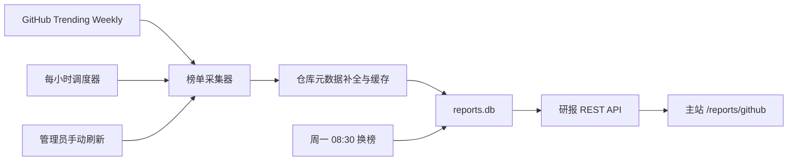

# GitHub 周榜研报模块设计

## 目标

在逐梦工具箱中新增一个独立的“研报”模块。首个研报产品是 GitHub 开源项目周榜：每小时轮询 GitHub Trending 的周榜数据，每周一 08:30（Asia/Shanghai）封存上一期并建立新一期，让访客可以查看综合榜及 Python、JavaScript、TypeScript、Go、Rust 分榜。

研报模块必须独立于股票、守岸人和 OpenWrite。采集、数据库或页面故障不得影响其他模块启动和使用。

## 已确认范围

- 公开访客可以浏览当前和历史周榜。
- 管理员使用全站统一账号登录后，可以手动刷新并查看采集状态。
- 每小时整点轮询一次当前周榜。
- 每周一 08:30 封存旧一期并创建新一期。
- 榜单包括综合榜、Python、JavaScript、TypeScript、Go 和 Rust。
- 每个榜单保留 GitHub Trending 返回的完整项目列表，不人为截成 Top 10。
- 页面标记新上榜、排名上升、排名下降、连续热门和增长最快项目。
- 首版只实现 GitHub 扫榜，不实现股票研报、论文研报、AI 自动点评或订阅推送。

## 开源项目调研

本模块借鉴以下项目的边界和思路，但不整仓复制源代码：

- [huchenme/github-trending-api](https://github.com/huchenme/github-trending-api)：MIT 许可，提供非官方 GitHub Trending 日榜、周榜、月榜解析接口。用于参考 Trending 页面解析边界。
- [vitalets/github-trending-repos](https://github.com/vitalets/github-trending-repos)：按语言定时抓取日榜与周榜。用于参考调度和按语言采集方式。
- [larsbijl/trending_archive](https://github.com/larsbijl/trending_archive)：归档 GitHub Trending 历史结果。用于参考历史快照用途。
- [EvanLi/Github-Ranking](https://github.com/EvanLi/Github-Ranking)：自动生成按总 Star 和 Fork 排序的榜单。它适合作为长期排名参考，但不作为“本周热度”的口径。
- [chinesehuazhou/python-weekly](https://github.com/chinesehuazhou/python-weekly)：技术周刊的信息组织案例。用于参考周刊式阅读体验，不引入其内容生产流程。

GitHub 没有稳定的官方 Trending API，因此核心榜单来源是 `github.com/trending` 的周榜页面。GitHub REST API 只用于补全仓库元数据，并通过缓存、条件请求和可选 Token 控制限额。

## 架构

新建顶层目录 `research-reports/`，包含独立 FastAPI 服务、SQLite 数据库、采集器、调度器和测试。服务默认监听 `127.0.0.1:8009`。

主站只依赖研报服务的 HTTP API，不直接读取其数据库。统一启动、停止和健康检查脚本管理端口 8009，但研报服务启动失败时应明确报告自身错误，不改变其他服务的数据。

## 数据来源与采集策略

### Trending 榜单

每次轮询请求以下周榜：

- `https://github.com/trending?since=weekly`
- `https://github.com/trending/python?since=weekly`
- `https://github.com/trending/javascript?since=weekly`
- `https://github.com/trending/typescript?since=weekly`
- `https://github.com/trending/go?since=weekly`
- `https://github.com/trending/rust?since=weekly`

解析器输出统一记录：仓库全名、排名、简介、主语言、总 Star、Fork、本周 Star、贡献者头像和仓库 URL。所有数值解析都必须容忍千位分隔符和 GitHub 文案的小幅变化。

### GitHub 元数据

GitHub REST API 补全许可证、Topics、归档状态、默认分支和最近更新时间。`GITHUB_TOKEN` 是可选环境变量，只能保存在 `.env.local`，不得进入仓库、日志或 API 响应。

没有 Token 时，榜单采集仍然可用。服务在公开 API 限额内逐步补全元数据，并优先复用缓存；许可证或 Topics 暂时缺失时页面显示“待补全”，不把整个项目判为采集失败。

### 请求纪律

- 使用明确的 User-Agent、连接超时和读取超时。
- 对 429、GitHub 5xx 和短暂网络错误执行有限次数指数退避。
- 对仓库元数据使用 ETag 或更新时间缓存，避免每小时重复请求不变信息。
- 六个榜单独立采集；单个语言失败不回滚其他语言的成功结果。
- HTML 结构无法解析时记录结构化错误并保留该榜单最近一次成功数据。

## 调度语义

所有调度时间使用 `Asia/Shanghai`。

### 小时轮询

每小时整点启动一次。若上一次任务仍在运行，本次任务跳过并记录 `skipped_overlap`，不得并发写入同一期榜单。自动任务和管理员手动刷新使用同一把进程内互斥锁。

小时轮询更新当前一期的最新排名，并追加小时观测点。相同榜单、相同采集时间的写入必须幂等。

### 周一换榜

研报周的唯一边界是每周一 08:30，而不是 ISO 周默认的周一 00:00。周一 00:00–08:29 仍属于上一期。新一期使用该次 08:30 边界所属的 ISO 年和 ISO 周编号。

每周一 08:30 执行以下事务：

1. 使用最近一次成功数据封存当前一期。
2. 创建以 ISO 周编号标识的新一期。
3. 执行新一期第一次采集。

如果 08:30 的 GitHub 请求失败，上一期仍然封存，新一期进入 `collecting` 状态并显示最近成功的旧榜作为延迟数据。下一次小时轮询继续补齐新一期。重复执行换榜任务不会创建第二个相同周编号。

服务启动时先计算“最近一个已经到达的周一 08:30 边界”，再检查该边界对应的期数是否存在。缺失时补建，确保周一凌晨不会提前换榜，也确保停机跨周后恢复不会继续写入旧一期。

## 数据模型

### Repository

- `id`
- `full_name`，唯一并统一为 GitHub 规范大小写
- `owner`
- `name`
- `description`
- `primary_language`
- `topics_json`
- `license_spdx`
- `html_url`
- `default_branch`
- `is_archived`
- `stars_total`
- `forks_total`
- `github_updated_at`
- `metadata_etag`
- `metadata_checked_at`
- `created_at`
- `updated_at`

### WeeklyIssue

- `id`
- `iso_year`
- `iso_week`
- `starts_at`
- `sealed_at`
- `status`：`collecting`、`sealed` 或 `delayed`
- `created_at`

`iso_year + iso_week` 建立唯一约束。

### RankingEntry

- `id`
- `issue_id`
- `repository_id`
- `category`：`all`、`python`、`javascript`、`typescript`、`go` 或 `rust`
- `rank`
- `previous_issue_rank`
- `stars_since_weekly`
- `first_seen_at`
- `last_seen_at`
- `consecutive_weeks`
- `status`：`new`、`rising`、`falling`、`steady` 或 `returned`

`issue_id + category + repository_id` 建立唯一约束。

### HourlyObservation

- `id`
- `issue_id`
- `repository_id`
- `category`
- `observed_at`
- `rank`
- `stars_total`
- `stars_since_weekly`

`issue_id + repository_id + category + observed_at` 建立唯一约束。

### CollectionRun

- `id`
- `trigger`：`scheduled_hourly`、`weekly_rollover`、`manual`
- `requested_by_site_user_id`，自动任务为空
- `started_at`
- `finished_at`
- `status`：`running`、`success`、`partial`、`failed` 或 `skipped_overlap`
- `categories_json`
- `error_summary`
- `duration_ms`

## 排名与标记规则

- `new`：上一期该分类没有该仓库，且更早历史中也没有出现。
- `returned`：上一期未出现，但更早一期出现过。
- `rising`：本期当前排名数字小于上一期最终排名。
- `falling`：本期当前排名数字大于上一期最终排名。
- `steady`：本期和上一期最终排名相同。
- `consecutive_weeks`：从当前期向前连续出现的期数。
- “增长最快”：同一分类中 `stars_since_weekly` 最大的项目；并列时按当前排名排序。
- 一期内小时级变化仅用于展示最近一小时排名和 Star 变化，不覆盖跨周状态。

仓库可以同时出现在综合榜和多个语言榜。仓库元数据只保存一份，榜单位置按分类分别保存。

## API

所有读取接口公开，修改接口使用现有 `site-auth` Cookie 会话和 CSRF 校验。

### 公开接口

- `GET /health`
- `GET /api/v1/issues?limit=&cursor=`
- `GET /api/v1/issues/current`
- `GET /api/v1/issues/{issue_id}`
- `GET /api/v1/issues/{issue_id}/rankings?category=&query=&language=&license=&status=`
- `GET /api/v1/repositories/{owner}/{name}`
- `GET /api/v1/status`：返回最近成功采集时间、下次计划时间和延迟分类，不返回内部堆栈。

榜单接口返回项目展示所需的仓库元数据、跨周排名和小时级变化，避免前端为每个项目再发请求。

### 管理员接口

- `POST /api/v1/admin/collections`：触发一次全分类刷新；任务已运行时返回 409。
- `GET /api/v1/admin/collections?limit=&cursor=`：查看采集记录。
- `GET /api/v1/admin/collections/{run_id}`：查看某次采集的分类级结果。

普通用户访问管理员接口返回 403，匿名用户返回 401。手动刷新只创建后台任务并返回 202，前端轮询该任务状态，不让 HTTP 请求等待完整采集过程。

## 前端

主站新增独立路由：

- `/reports`：研报入口页，首版直接展示 GitHub 周榜产品卡片和最新一期摘要。
- `/reports/github`：GitHub 开源项目周榜。

GitHub 周榜页采用全宽研报布局，而不是通用工具弹窗。页面包含：

1. 标题、ISO 周期、最近采集时间、下次采集时间和数据健康状态。
2. 综合榜及五个语言分榜标签页。
3. 新上榜数量、持续热门数量、增长最快项目和本周 Star 总量摘要。
4. 周期选择器、关键词搜索、语言、许可证和状态筛选。
5. 完整榜单。桌面端使用信息密度较高的榜单行，移动端使用卡片。
6. 管理员可见的手动刷新按钮和采集状态入口。

每个项目展示：

- 当前排名及相对上期的升降。
- `new`、`returned`、持续热门或增长最快标记。
- 仓库全名、简介、主语言、许可证和 Topics。
- 总 Star、本周 Star、新增 Star 和连续上榜周数。
- 只在新标签页打开的 GitHub 仓库链接。

加载、空数据、部分延迟和全部失败必须使用不同状态。页面不得用示例项目伪装成真实数据。

## 安全与隐私

- 仅接受 `github.com/{owner}/{repo}` 形式的仓库链接；前端外链增加 `noopener noreferrer`。
- 简介和 Topics 作为纯文本渲染，不注入 GitHub 返回的 HTML。
- `GITHUB_TOKEN`、内部服务密钥、Cookie 和完整错误堆栈不得写入数据库展示字段或日志。
- 管理员手动刷新复用全站认证，不新增研报专用用户名或密码。
- 外部响应设置最大体积和超时，避免异常页面无限占用内存。

## 配置与运行

新增本地配置变量：

- `RESEARCH_REPORTS_HOST=127.0.0.1`
- `RESEARCH_REPORTS_PORT=8009`
- `RESEARCH_REPORTS_DATA_DIR=research-reports/data`
- `RESEARCH_REPORTS_TIMEZONE=Asia/Shanghai`
- `RESEARCH_REPORTS_SITE_AUTH_URL=http://127.0.0.1:8000`
- `GITHUB_TOKEN`，可选

示例配置只列变量名和安全默认路径，不包含真实 Token。SQLite 数据库、采集缓存、日志和导出文件必须被 Git 忽略。

主站开发代理增加 `/reports-api/` 到 8009 的映射；生产 Nginx 使用相同前缀，避免与守岸人的 `/api/` 冲突。

## 可观测性与错误处理

- 健康检查区分进程健康与数据新鲜度；GitHub 临时不可用不让 `/health` 返回进程故障。
- `/api/v1/status` 将超过 90 分钟未成功更新的分类标记为 `delayed`。
- 每次采集记录分类级状态、HTTP 状态、解析数量和耗时，但不保存整页 HTML 到日志。
- 管理员页面显示可读错误摘要；详细异常只保留在本地服务日志中。
- 数据库事务按分类提交。新结果完成解析和校验后再替换当前视图，禁止先清空旧榜。

## 测试与验收

### 后端

- 使用固定 HTML 样本验证六个分类的解析和数值格式。
- HTML 缺少必要字段时解析器明确失败，不产生空榜。
- 单分类失败时其他分类成功写入，失败分类保留旧数据。
- 模拟时间验证小时整点任务、周一 08:30 换榜、跨周启动恢复和幂等执行。
- 自动采集与手动刷新互斥，重叠请求返回或记录正确状态。
- 验证新上榜、回归、升降、连续周数和增长最快规则。
- 无 Token、Token 限额耗尽、429、超时和 GitHub 5xx 均有覆盖。
- 匿名访客可读榜单；匿名和普通用户不能手动刷新；管理员可刷新并查看记录。

### 前端

- 六个标签页、历史周期、搜索和筛选正确组合。
- 桌面榜单与 360px 移动卡片均可阅读和操作。
- 键盘可以切换标签、筛选和打开项目；状态标记不只依赖颜色。
- 加载、空数据、部分延迟、服务离线和管理员刷新状态都有明确提示。
- GitHub 外链安全属性正确，接口文本不会作为 HTML 注入。

### 集成

- 统一启动脚本启动 8009，停止脚本只终止受管研报进程。
- 统一健康检查覆盖研报健康、公开榜单和管理员刷新鉴权。
- 主站 `/reports` 和 `/reports/github` 刷新后可直接访问，不依赖从首页进入。
- 研报服务停止时，股票、守岸人、OpenWrite 和其他工具仍可访问。

## 非目标

- 首版不生成 AI 项目评价、投资建议或自动中文翻译。
- 首版不抓取 GitHub 用户隐私数据、Issue 正文、Commit 内容或 Release 附件。
- 首版不提供邮件、微信、Telegram 或站内推送。
- 首版不允许用户自定义语言榜或关注仓库。
- 首版不导入上述开源仓库的完整代码或历史数据。

## 完成标准

当以下条件同时满足时，首版完成：

1. 8009 独立服务可随全站启动并通过健康检查。
2. 当前一期能展示综合榜和五个语言分榜的真实 GitHub 数据。
3. 每小时任务和周一 08:30 换榜在模拟时钟测试中可重复、幂等。
4. 至少两期测试数据可以正确显示新上榜、升降和连续热门。
5. 管理员可手动刷新，访客和普通用户不能调用写接口。
6. GitHub 故障不会清空最近成功榜单，也不会影响其他模块。
7. `.env.local`、Token、数据库、缓存和日志均不会被 Git 提交。
