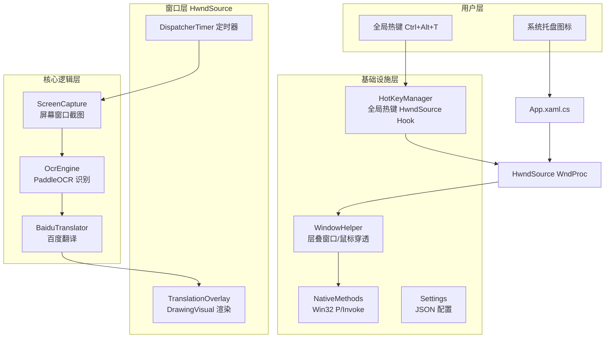
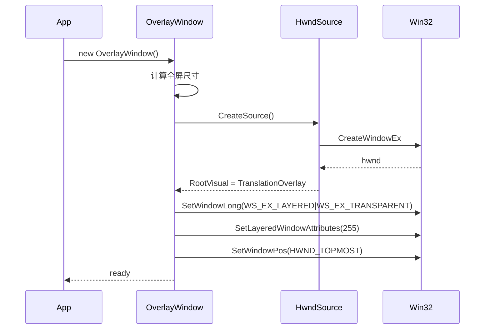
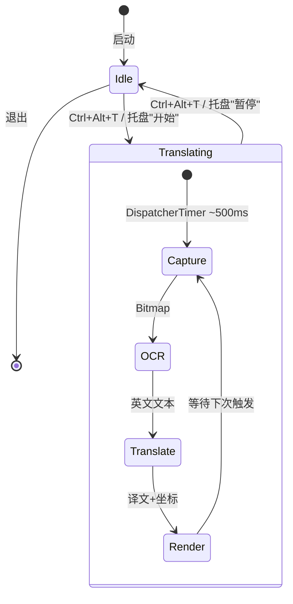

# C# WPF 悬浮屏幕翻译软件 — 完整开发计划（HwndSource 方案）

## 一、架构总览



## 二、项目结构

```
ScreenTranslator/
├── ScreenTranslator.csproj          # .NET 8 WPF 项目
├── App.xaml                         # 应用入口
├── App.xaml.cs                      # 托盘图标、启动/退出逻辑
│
├── OverlayWindow.cs                 # ★ HwndSource 透明覆盖窗口（核心）
├── TranslationOverlay.cs            # DrawingVisual 译文渲染
│
├── Native/
│   ├── NativeMethods.cs             # Win32 P/Invoke 声明
│   ├── WindowHelper.cs              # 窗口管理工具
│   └── HotKeyManager.cs             # 全局热键
│
├── Core/
│   ├── ScreenCapture.cs             # 屏幕/窗口截图
│   ├── OcrEngine.cs                 # PaddleOCR 封装
│   └── BaiduTranslator.cs           # 百度翻译 API
│
├── Config/
│   └── Settings.cs                  # JSON 配置
│
├── Models/
│   ├── OcrResult.cs                 # OCR 结果
│   └── TranslationResult.cs         # 翻译结果
│
└── Resources/icons/                 # 托盘图标
```

## 三、HwndSource 透明窗口方案（核心技术决策）

### 3.1 为什么不用 WPF `AllowsTransparency`？

| 方案 | 问题 |
|------|------|
| `WindowStyle="None" + AllowsTransparency="True"` | ❌ 渲染性能差，不能硬件加速 ❌ 有 WS_EX_LAYERED 限制，子控件渲染问题 ❌ 窗口移动/缩放时严重闪烁 |
| **HwndSource + WS_EX_LAYERED** | ✅ 直接控制窗口创建 ✅ 每像素 Alpha 透明 ✅ 无闪烁 ✅ 可与 DirectX 互操作 |

### 3.2 HwndSource 窗口创建流程



### 3.3 核心窗口参数

```csharp
var parameters = new HwndSourceParameters("ScreenTranslatorOverlay")
{
    // 全屏尺寸
    Width = virtualScreenWidth,
    Height = virtualScreenHeight,
    // 窗口样式：弹出窗口 + 可见
    WindowStyle = WS_POPUP | WS_VISIBLE,
    // 扩展样式：层叠透明 + 鼠标穿透 + 工具窗口 + 不激活
    ExtendedWindowStyle = WS_EX_LAYERED | WS_EX_TRANSPARENT 
                        | WS_EX_TOOLWINDOW | WS_EX_NOACTIVATE,
    // ★ 关键：每像素透明度（配合 WS_EX_LAYERED）
    UsesPerPixelOpacity = true,
    // 消息钩子
    HwndSourceHook = WndProc,
};
```

## 四、类职责与接口

### 4.1 OverlayWindow.cs（核心新增）
```csharp
// 管理 HwndSource 窗口的整个生命周期
public sealed class OverlayWindow : IDisposable
{
    // 窗口句柄
    IntPtr Handle { get; }
    
    // 生命周期
    void Create();              // 创建窗口
    void Show();                // 显示 + 置顶
    void Hide();                // 隐藏
    void Close();               // 销毁
    
    // 翻译循环控制
    void StartTranslation();    // 开始定时翻译
    void StopTranslation();     // 停止定时翻译
    bool IsTranslating { get; }
    
    // 渲染更新
    void UpdateOverlay(TranslationItem[] items);
    void ClearOverlay();
    
    // 事件
    event Action WindowCreated;
    event Action WindowDestroyed;
}

// 渲染条目
public class TranslationItem
{
    string Text { get; init; }          // 译文
    int ScreenX { get; init; }          // 屏幕绝对坐标
    int ScreenY { get; init; }
    int SourceWidth { get; init; }      // 原文宽度（用于文本适配）
    int SourceHeight { get; init; }
}
```

### 4.2 TranslationOverlay.cs（重写）

不再使用 XAML，直接继承 `FrameworkElement`，通过 `OnRender(DrawingContext)` 绘制：

```csharp
public class TranslationOverlay : FrameworkElement
{
    // 渲染条目集合
    private List<TranslationItem> _items = new();
    
    // 可配置样式
    public double FontSize { get; set; } = 16;
    public Color FontColor { get; set; } = Colors.White;
    public double StrokeThickness { get; set; } = 2;
    public Color StrokeColor { get; set; } = Colors.Black;
    public byte BackgroundAlpha { get; set; } = 0x60;
    
    // 更新渲染数据并触发重绘
    public void UpdateItems(IEnumerable<TranslationItem> items) { ... }
    
    // 核心绘制逻辑
    protected override void OnRender(DrawingContext dc) { ... }
}
```

### 4.3 其他类调整

| 类 | 调整 |
|----|------|
| `MainWindow.xaml/cs` | ❌ 删除，不再使用传统 Window |
| `App.xaml` | ✅ 保留，定义应用和样式资源 |
| `App.xaml.cs` | ✅ 启动时创建 OverlayWindow，管理托盘图标 |
| `Native/WindowHelper.cs` | ✅ 更新：专门处理层叠窗口样式 |
| `Native/HotKeyManager.cs` | ✅ HwndSource Hook 直接挂接到 OverlayWindow |

## 五、核心流程



## 六、性能优化

| 目标 | 措施 |
|------|------|
| CPU < 5% | ① OCR+翻译异步执行(Task.Run) ② 截图复用 Bitmap ③ 无变化不重绘 |
| 内存 < 100MB | ① 及时 Dispose 非托管资源 ② 翻译缓存字典 ③ 弱引用 |
| 低延迟 | ① 异步流水线 ② SemaphoreSlim 控制并发 ③ 优先渲染再翻译 |

## 七、实施步骤

### Phase 1：项目骨架
- [ ] 创建 .NET 8 WPF 项目 + 目录结构
- [ ] 安装 NuGet 依赖
- [ ] 实现 NativeMethods.cs
- [ ] 实现 Models (OcrResult, TranslationResult)

### Phase 2：窗口层
- [ ] 实现 OverlayWindow.cs（HwndSource 创建/管理）
- [ ] 实现 TranslationOverlay.cs（DrawingVisual 渲染）
- [ ] 实现 WindowHelper.cs（窗口样式/置顶/穿透）

### Phase 3：核心功能
- [ ] 实现 ScreenCapture.cs（BitBlt 截图）
- [ ] 实现 OcrEngine.cs（PaddleOCR 封装）
- [ ] 实现 BaiduTranslator.cs（百度翻译 API）

### Phase 4：集成
- [ ] 实现 HotKeyManager.cs（全局热键）
- [ ] 实现 Settings.cs（配置读写）
- [ ] 实现 App.xaml/cs（入口 + 托盘图标）
- [ ] 完整流程联调

## 八、验证标准

| 项目 | 标准 |
|------|------|
| 透明窗口 | 完全透明，任何背景正常显示 |
| 鼠标穿透 | 无法选中窗口任何区域 |
| 置顶 | 始终最上层 |
| 热键 | Ctrl+Alt+T 即时开关 <100ms |
| 内存 | 稳定运行 < 80MB |
| CPU | 空闲 < 1%，翻译时 < 8% |
