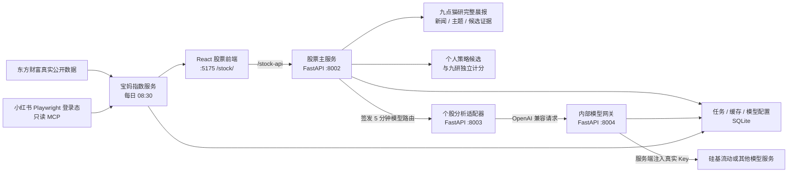

# Star Dominion 股票研究模块

  

面向沪深 A 股主板的浅色晨间研究工作台：九点猫研负责隔夜市场映射与晨报，个人策略保留独立候选池，任意主板股票都能先查看结构化依据，再按次选择模型生成详细分析。

## 当前能力

- 首页以“九点猫研 · 今日晨报”为主区，展示隔夜主题、完整九研评分依据和主板候选；个人策略在右侧独立展示，不合并两套分数。
- 首页另设“小市值倍量吸筹”独立列：扫描沪深主板总市值严格低于 100 亿元的真实行情，寻找最近三个交易日内的首日倍量，并检查此前 30 个交易日无其他倍量、价格区间不超过 25%、最大回撤不超过 15%。
- 首页展示上一交易日收盘后至今日开盘前的前 5–8 条重要消息；“阅读每日报纸”进入同一模块内的完整单栏晨报。
- 九研和个人策略的候选都能打开同一个 560px 右侧详情抽屉；任意合法主板代码也能直接打开该抽屉。
- 详情先显示来源、选股原因、维度分、历史统计、催化、风险和无效条件，不调用大模型也能阅读。
- 九研与个人策略同时命中的股票显示“双重命中”，但两套依据和评分始终分开展示。
- 支持沪市 `600`、`601`、`603`、`605` 与深市 `000`、`001`、`002` 六位代码。
- 股票目录由 AKShare 获取沪深主板真实名单并写入 SQLite，支持代码、中文名称和拼音首字母搜索；工作日 07:45 自动更新，管理员可手动刷新。
- 排除科创板、创业板和北交所。
- 晨报和候选刷新复用同一个后台任务：先运行配置好的 Worker，再归一化完整晨报，最后刷新候选快照。
- 晨报刷新失败但存在历史成功数据时继续展示旧报，并明确标记“当前展示最近成功晨报”。
- 小市值行情来自 AKShare 东方财富全市场行情的“总市值”字段；接口失败时不伪造市值，原有个人策略继续刷新，新策略沿用上一份有效候选并标记 stale，首次失败标记 error。
- 页面内保存个人 OpenAI 兼容 API 配置，预置硅基流动 Base URL，但不预填 Key 或模型。
- 正式接入主站后可同时提供“平台配置”和“个人配置”；每次分析都必须重新选择配置和模型，不设默认值。
- 个股分析任务、状态和报告缓存持久化在 SQLite，页面轮询展示采集、分析、整理和完成状态。
- 宝妈指数保持独立，只作反向情绪温度计，不读取或改变候选评分；展示纳斯达克、黄金、CPO 通信、半导体四个板块及历史趋势。
- 宝妈指数只使用东方财富真实公开帖子和小红书登录态真实搜索结果；每天 08:30 自动采集，管理员可在页面刷新或打开 Playwright 登录窗口恢复小红书登录态。

三个上游仓库位于 `../upstreams/`，适配层不修改它们的工作树。

## 架构



| 组件 | 责任 | 网络边界 |
|---|---|---|
| 前端 | 浅色晨报工作台、完整报纸、详情抽屉、模型设置、任务状态和安全报告渲染 | 浏览器只访问 `8002` 的公开 API |
| 股票主服务 | 主板校验、晨报/候选编排、历史晨报、研究上下文、模型配置、任务与缓存、短期路由签发 | 本地 `127.0.0.1:8002`；网站部署时由主站反代 |
| 个股分析适配器 | 用请求级配置调用 `daily_stock_analysis`，固定关闭通知 | 仅内部 `127.0.0.1:8003` |
| 模型网关 | 验证服务令牌和短期路由，解密/读取 Key，转发模型请求 | 仅内部 `127.0.0.1:8004`，无公开文档 |
| SQLite | 股票目录、宝妈指数快照、候选快照、模型密文、任务、报告和模型目录缓存 | `data/hub.db`，不保存路由令牌 |

### 分析调用链

```text
浏览器明确选择 股票 + 配置 + 模型
  -> 8002 创建任务并签发短期路由
  -> 8003 复制一份 DSA 配置，固定 notify=false
  -> 8004 验签，从服务端读取真实 API Key
  -> 模型服务
  -> 报告写入 SQLite
  -> 浏览器轮询状态并读取报告
```

个人配置的缓存按用户、配置、股票、模型和报告类型隔离；平台配置可以共享相同参数的报告缓存。`force_refresh=true` 会绕过缓存。

## 目录

```text
stock-module/
├── backend/                 # 股票主服务、内部网关、候选 Worker
│   ├── app/main.py          # :8002
│   ├── app/gateway_main.py  # :8004
│   └── tests/
├── analysis-service/        # daily_stock_analysis 隔离适配器，:8003
├── frontend/                # React 19 + TypeScript + Vite，:5175
└── data/                    # 运行时自动生成，已被 gitignore，不随源码搬迁
```

## 安装

要求：Python 3.11、Node.js 18+、npm 9+。

后端和分析适配器共用一个本地虚拟环境：

```powershell
cd E:\AI\gp\stock-research-package\stock-module\backend
python -m venv .venv
.\.venv\Scripts\python.exe -m pip install --upgrade pip setuptools wheel
.\.venv\Scripts\python.exe -m pip install -e ".[dev,workers]"

cd E:\AI\gp\stock-research-package\stock-module\analysis-service
..\backend\.venv\Scripts\python.exe -m pip install -e .

cd E:\AI\gp\stock-research-package\stock-module\frontend
npm.cmd install
```

分析适配器固定使用有 Windows wheel 的 `litellm==1.80.10`，避免最新版源码包在 Windows 本地触发 Rust 编译。AlphaSift、机器人、桌面端等上游可选依赖不进入本模块运行环境。

`.[workers]` 已包含九点猫研和个人策略需要的行情、表格与网络依赖。两个 Worker 都使用股票主服务当前的 Python 解释器，不需要再为九点猫研创建第二个虚拟环境。

它也包含股票目录与宝妈指数所需的 AKShare、APScheduler、拼音索引和 Python MCP 客户端。小红书采集器由 Node.js 按固定版本启动：

```text
rednote-mcp (Playwright MCP，stdio 模式)
```

该集成只允许认证状态、账号登录、登录轮询、搜索和帖子详情工具，所有写操作均被后端白名单拒绝。

## 本地配置

### 股票目录与宝妈指数

`.env.local` 建议配置：

```dotenv
STOCK_XHS_DATA_DIR=stock-research-package/stock-module/data/xhs-mcp
STOCK_XHS_MCP_COMMAND=npx.cmd -y rednote-mcp@0.2.3 --stdio
STOCK_MARKET_PROXY=
STOCK_MOM_REFRESH_TIME=08:30
STOCK_TIMEZONE=Asia/Shanghai
```

Windows 使用 `npx.cmd`；Linux/宝塔使用 `npx`。`STOCK_MARKET_PROXY` 仅在部署网络确有需要时填写。启动后管理员在宝妈指数卡片点击“打开小红书登录窗口”，在 Playwright 浏览器窗口完成登录，登录态只保存在 `STOCK_XHS_DATA_DIR`。东方财富或小红书其中一个失败时会保存部分成功快照；两个来源均失败时不会用模拟数据覆盖最近真实快照。

### 开发密钥

开发环境首次读取配置时，会在 `data/secrets/` 创建三个随机密钥文件：

- `model-master.key`：加密个人 API Key。
- `route-signing.key`：签发个股任务的短期模型路由。
- `gateway-service.token`：8003 调用 8004 的内部服务令牌。

先生成开发配置，再把网关令牌加入当前 PowerShell 环境：

```powershell
$env:STOCK_DATA_DIR="E:\AI\gp\stock-research-package\stock-module\data"
cd E:\AI\gp\stock-research-package\stock-module\backend
.\.venv\Scripts\python.exe -c "from app.config import Settings; Settings.from_env()"
$env:STOCK_GATEWAY_SERVICE_TOKEN=(Get-Content "E:\AI\gp\stock-research-package\stock-module\data\secrets\gateway-service.token" -Raw).Trim()
$env:DSA_SOURCE_ROOT="E:\AI\gp\stock-research-package\upstreams\daily_stock_analysis"
```

在每个用于启动 8002、8003、8004 的 PowerShell 窗口执行相同的 `STOCK_DATA_DIR` 和 `STOCK_GATEWAY_SERVICE_TOKEN` 设置。8002 与 8004 会从同一个数据目录读取主密钥和路由签名密钥。

### 候选 Worker

股票主服务会在开发和生产环境自动注册两个内置 Worker：

- 九点猫研执行上游 `ashare_us_catalyst.cli`，默认把报告写入 `upstreams/a-share-us-catalyst/dist/data/`。
- 个人策略生成最多 120 只热门主板股票的 K 线快照，再执行 2B 法则、首板沿 5 日线和龙头识别。

个人策略优先读取东方财富热门概念；概念接口断开时自动切换新浪全市场行情，个股历史行情也保留东方财富到新浪的降级。同时 Worker 会单独读取东方财富全市场“总市值”，生成 small_cap_stocks 区块供小市值倍量吸筹策略使用。科创板、创业板、北交所、ST 和退市股票会在生成与导入阶段各过滤一次。

小市值策略的“倍量”定义为当日成交量大于等于前 5 个交易日平均成交量的 2 倍；只检查最近 3 个交易日，取最早符合日并标记“首日倍量”。策略使用 30 个交易日的收盘价区间和最大回撤近似低波动吸筹形态，不宣称能够证明股票不存在庄家或操纵行为。

通常不需要设置 Worker 环境变量。需要调整解释器、参数、工作目录或超时时间时，可以用以下服务端变量覆盖内置命令；浏览器不能提交命令。

```powershell
$catWorker = @{
  args = @(
    "E:\AI\gp\stock-research-package\stock-module\backend\.venv\Scripts\python.exe",
    "-m", "ashare_us_catalyst.cli",
    "--output", "dist/data",
    "--top", "5"
  )
  cwd = "E:\AI\gp\stock-research-package\upstreams\a-share-us-catalyst"
  env = @{ PYTHONPATH = "src" }
  timeout_seconds = 1800
} | ConvertTo-Json -Compress
$env:CATALYST_WORKER_COMMAND_JSON=$catWorker

$strategyWorker = @{
  args = @(
    "E:\AI\gp\stock-research-package\stock-module\backend\.venv\Scripts\python.exe",
    "-m", "workers.user_strategy_snapshot",
    "--output", "E:\AI\gp\stock-research-package\stock-module\data\user-strategy\latest.json",
    "--top-concepts", "10",
    "--max-stocks", "120",
    "--lookback-days", "420"
  )
  cwd = "E:\AI\gp\stock-research-package\stock-module\backend"
  timeout_seconds = 1800
} | ConvertTo-Json -Compress
$env:USER_STRATEGY_WORKER_COMMAND_JSON=$strategyWorker
```

命令以 `shell=False` 执行，不经过 PowerShell、CMD 或 Shell 二次解析。页面上的刷新操作只会触发这些服务端已注册命令。

### 九点猫研完整晨报路径

`CATALYST_REPORT_PATH` 默认是 `upstreams/a-share-us-catalyst/dist/data/`。它也可以指向其他结构化晨报目录或单个 JSON；指向目录时，适配器读取名称排序最后的 `*-morning.json`。适配器保留主题信号、候选维度分、历史统计、新闻催化、风险和无效条件，并在进入公开 API 前再次过滤为 A 股主板。

```powershell
$env:CATALYST_REPORT_PATH="E:\AI\gp\stock-research-package\upstreams\a-share-us-catalyst\dist\data"
```

重要消息时间窗使用 `Asia/Shanghai`：从上一实际交易日 `15:00` 开始，到当前时刻与本交易日 `09:30` 中较早者结束。09:30 之后刷新仍固定截止到 09:30。系统按标题去重并确定性排序；不足 5 条时按真实数量展示，不生成占位消息。

### 平台模型配置（主站接入时）

平台配置只保存环境变量名，不把平台 Key 写入 SQLite。以下示例均为占位符：

```powershell
$env:STOCK_PLATFORM_SF_KEY="<platform-api-key>"
$platformProfiles = @(
  @{
    id = "platform-siliconflow"
    name = "平台硅基流动"
    provider = "siliconflow"
    base_url = "https://api.siliconflow.cn/v1"
    api_key_env = "STOCK_PLATFORM_SF_KEY"
    timeout_seconds = 120
    enabled = $true
  }
) | ConvertTo-Json -Compress
$env:STOCK_PLATFORM_MODEL_PROFILES_JSON=$platformProfiles
```

8002 和 8004 必须获得相同的 `STOCK_PLATFORM_MODEL_PROFILES_JSON` 与平台 Key 环境变量。页面会同时显示平台和个人配置，但不会自动选择任何一个。

## 启动四个服务

在各窗口设置上一节的公共环境变量后，按以下顺序启动。

窗口 1，内部模型网关：

```powershell
cd E:\AI\gp\stock-research-package\stock-module\backend
.\.venv\Scripts\python.exe -m uvicorn app.gateway_main:app --host 127.0.0.1 --port 8004
```

窗口 2，个股分析适配器：

```powershell
$env:DSA_SOURCE_ROOT="E:\AI\gp\stock-research-package\upstreams\daily_stock_analysis"
cd E:\AI\gp\stock-research-package\stock-module\analysis-service
..\backend\.venv\Scripts\python.exe -m uvicorn analysis_service.main:app --host 127.0.0.1 --port 8003
```

窗口 3，股票主服务：

```powershell
cd E:\AI\gp\stock-research-package\stock-module\backend
.\.venv\Scripts\python.exe -m uvicorn app.main:app --host 127.0.0.1 --port 8002
```

窗口 4，前端：

```powershell
cd E:\AI\gp\stock-research-package\stock-module\frontend
npm.cmd run dev
```

打开 `http://127.0.0.1:5175/stock/`。Vite 将 `/stock-api/*` 转发到 `127.0.0.1:8002`。

## 使用晨报、详情和硅基流动

1. 打开工作台，先阅读九点猫研晨报、个人策略、小市值倍量吸筹和盘后至开盘前重要消息。
2. 点击任一候选的“详情/查看依据”，或在顶部输入任意六位主板代码，打开结构化详情抽屉。
3. 需要完整晨报时点击“阅读每日报纸”；返回工作台后原有晨报和候选状态不丢失。
4. 需要 AI 详细分析时，点击顶部“模型与 API”。
5. 选择“硅基流动”；Base URL 自动填入 `https://api.siliconflow.cn/v1`，API Key 保持空白。
6. 填写配置名称和自己的 Key，保存。保存成功后浏览器内 Key 输入框立即清空。
7. 可点击“测试连接”。该操作只验证鉴权或读取模型列表，不创建个股分析任务。
8. 回到股票详情，明确选择模型配置，再明确选择模型。模型目录加载失败时可以手动填写模型 ID。
9. 点击“生成个股详细分析”，观察任务从等待、采集、分析、整理进入完成状态。

系统不保存“上次选择”为默认模型。刷新页面或重新进入分析器后，需要再次选择。

## 公开 API

| 方法 | 路径 | 用途 |
|---|---|---|
| `GET` | `/api/v1/health` | 股票主服务健康状态 |
| `GET` | `/api/v1/stocks/search` | 搜索预载的 A 股主板目录 |
| `GET` | `/api/v1/candidates` | 获取猫研、用户策略和小市值倍量吸筹候选；来源状态独立返回 |
| `POST` | `/api/v1/candidates/refresh` | 创建候选 Worker 后台任务 |
| `GET` | `/api/v1/candidates/refresh/{task_id}` | 查询候选刷新状态 |
| `GET` | `/api/v1/morning-report/current` | 获取首页晨报摘要，重要消息最多 8 条 |
| `POST` | `/api/v1/morning-report/refresh` | 复用候选刷新编排，创建完整晨报刷新任务 |
| `GET` | `/api/v1/morning-reports?limit=20` | 获取可用晨报日期历史 |
| `GET` | `/api/v1/morning-reports/{date}` | 获取指定日期完整每日报纸 |
| `GET` | `/api/v1/stocks/{symbol}/research-context` | 聚合九研、个人策略和小市值倍量吸筹的独立依据；任意合法主板代码均可查询 |
| `GET/POST` | `/api/v1/model-profiles` | 列表或创建个人模型配置 |
| `PATCH/DELETE` | `/api/v1/model-profiles/{profile_id}` | 修改或删除个人配置 |
| `POST` | `/api/v1/model-profiles/{profile_id}/test` | 测试鉴权/模型 |
| `GET` | `/api/v1/model-profiles/{profile_id}/models` | 读取缓存或刷新模型目录 |
| `POST` | `/api/v1/model-profiles/{profile_id}/models/refresh` | 强制刷新模型目录 |
| `POST` | `/api/v1/analyses` | 创建个股分析任务，返回 `202` |
| `GET` | `/api/v1/analyses/{task_id}` | 查询任务状态 |
| `GET` | `/api/v1/analyses/{task_id}/report` | 读取已完成报告 |

8003 和 8004 是内部接口，不通过前端或公网暴露。

## 安全边界

- 个人 API Key 使用 Fernet 加密后写入 `model_secrets`，公开响应不含 Key、密文或 `secret_ref`。
- 平台 API Key 只从指定环境变量读取。
- 页面不把 API Key 写入 `localStorage`、`sessionStorage`、URL 或任务记录。
- 8003 只收到五分钟有效的签名路由，不收到真实模型 Key。
- 8004 验证内部服务令牌、模型和签名声明后才读取 Key；传入的浏览器 Authorization 会被替换。
- 模型服务 URL 每次请求前进行协议、DNS 和 IP 检查。生产环境只允许 HTTPS 公网地址，并阻止私网、回环、链路本地和重定向绕过。
- 上游个股分析固定 `notify=false` 和 `async_mode=false`，不会触发上游机器人或通知渠道。
- 报告使用 React 文本转义，不渲染原始 HTML。

原目录中的 `gpBD.py` 和 `gpYD.py` 含历史硬编码凭据。正式部署前必须轮换这些凭据，不得把它们复制到新配置。

### 生产环境

`STOCK_ENV=production` 时必须显式提供：

```powershell
$env:STOCK_ENV="production"
$env:STOCK_MODEL_MASTER_KEY="<fernet-compatible-master-key>"
$env:STOCK_ROUTE_SIGNING_KEY="<long-random-signing-key>"
$env:STOCK_GATEWAY_SERVICE_TOKEN="<long-random-service-token>"
```

生产环境不要设置 `STOCK_ALLOW_PRIVATE_MODEL_ENDPOINTS`。由 Nginx 或主站网关提供 HTTPS、限流和 `/stock-api` 反向代理；8003、8004 只绑定内部网络。

## 故障排查

| 现象 | 检查 |
|---|---|
| 页面提示“模型配置不存在” | 配置是否被删除；8002 与 8004 是否使用同一个 `STOCK_DATA_DIR` |
| 页面提示晨报暂不可用 | 检查 `CATALYST_REPORT_PATH`；目录模式下是否存在 `*-morning.json`；可先运行九点猫研刷新任务 |
| 页面显示“当前展示最近成功晨报” | 本次晨报刷新失败，系统正在使用 SQLite 中最近成功快照；检查九研 Worker 与报告路径后重新刷新 |
| 小市值倍量吸筹显示 stale/error | 检查东方财富全市场行情及“总市值”字段；stale 表示继续展示上一份有效小市值快照，error 表示尚无可用小市值快照 |
| 股票搜索为空 | 管理员先触发股票目录刷新；检查 AKShare 网络访问和 `STOCK_MARKET_PROXY` |
| 小红书提示重新登录 | 管理员在宝妈指数卡片打开登录窗口；检查 `STOCK_XHS_DATA_DIR` 权限及 Node.js/npm |
| 宝妈指数显示部分可用 | 查看来源状态；单源失败不会生成模拟数据，也不会影响另一真实来源 |
| 个人策略可用但九研不可用 | 两个来源故障隔离，属于预期降级；个人策略仍可独立使用 |
| 模型列表加载失败 | Base URL 是否以 `/v1` 结尾、Key 是否有效、服务是否允许 `/models`；可切换手动模型 ID |
| `MODEL_AUTH_FAILED` | Key 无效或无权访问该模型；公开错误不会显示供应商原始响应 |
| `INVALID_MODEL_ROUTE` | 8002 与 8004 的路由签名键或服务令牌不一致，或任务路由已超过五分钟 |
| 8003 启动失败 | `DSA_SOURCE_ROOT` 是否指向含 `src/core/pipeline.py` 的仓库；是否安装 `analysis-service` 依赖 |
| 任务停在失败 | 查看 8002/8003/8004 是否都在运行；任务只保存安全错误，不保存上游 traceback |
| 自定义本地模型地址被阻止 | 仅开发环境可显式设置 `STOCK_ALLOW_PRIVATE_MODEL_ENDPOINTS=true`；生产环境始终阻止私网模型地址 |

## 验证

```powershell
cd E:\AI\gp\stock-research-package\stock-module\backend
.\.venv\Scripts\python.exe -m pytest -q
.\.venv\Scripts\python.exe -m pip check

cd E:\AI\gp\stock-research-package\stock-module\analysis-service
..\backend\.venv\Scripts\python.exe -m pytest -q

cd E:\AI\gp\stock-research-package\stock-module\frontend
npm.cmd test
npm.cmd run build
```

网络模型调用不属于离线测试。没有用户提供的硅基流动 Key 时，不会自动发起付费请求。

## 接入 Star Dominion

```text
/stock/*       -> frontend/dist
/stock-api/*   -> 股票主服务 :8002
127.0.0.1:8003 -> 仅股票主服务调用
127.0.0.1:8004 -> 仅个股分析适配器调用
```

登录系统不在本模块实现。接入主站后，由主站身份层提供真实用户 ID，再把当前本地 `owner_id="local"` 替换为主站用户上下文；个人配置和缓存隔离接口已经按 owner 设计。

## 上游与许可证

| 项目 | 许可证现状 | 当前处理 |
|---|---|---|
| `daily_stock_analysis` | 仓库含 MIT LICENSE | 通过独立适配服务导入，保留原版权声明 |
| `a-share-us-catalyst` | 未发现 LICENSE 文件 | 仅本地适配；公开部署前取得授权或重写所需能力 |
| `mom-index` | README 声称 MIT，但仓库无 LICENSE 文件 | 保持独立；公开部署前补齐授权证明或重写 |
